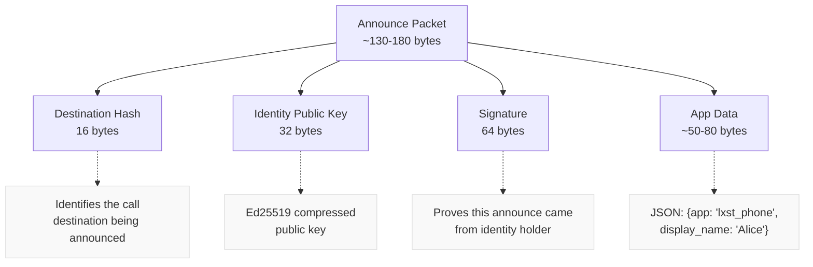
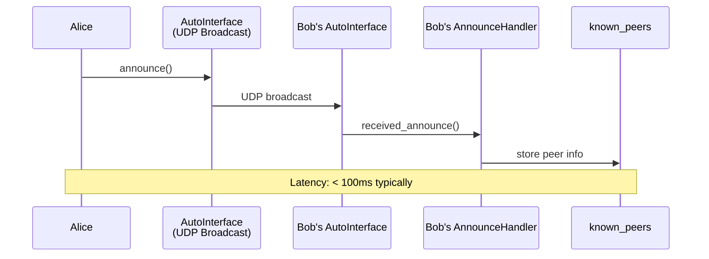
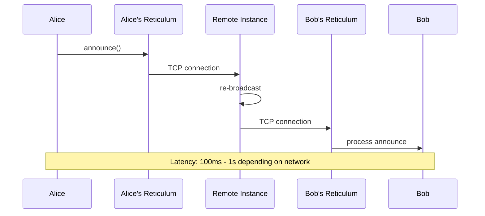
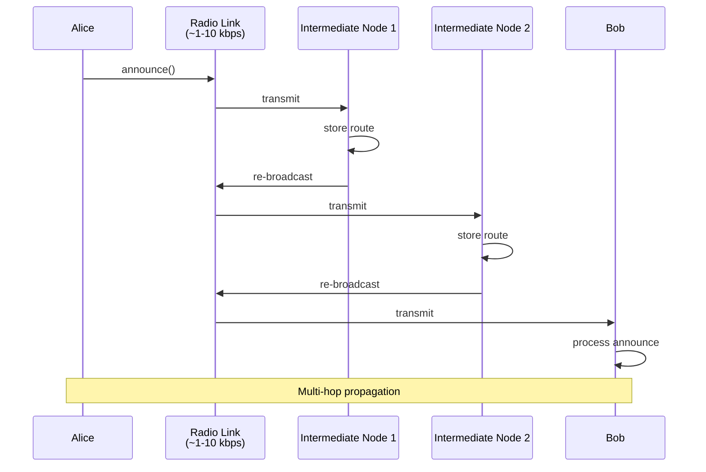
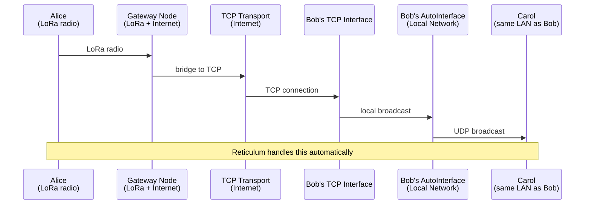

# Presence Announcements and Peer Discovery

This document explains how LXST Phone discovers peers on the network using Reticulum's announce mechanism.

## Overview

LXST Phone uses Reticulum's **built-in announce system** for peer discovery. This is fundamentally different from traditional VoIP discovery mechanisms:

- **No central server** - No SIP registrar, no STUN server, no directory service
- **Transport agnostic** - Works across local networks, internet, radio, LoRa, and mixed-mode meshes
- **Automatic propagation** - Announces flow across all interfaces without manual routing
- **Cryptographically signed** - Each announce contains the sender's public key
- **Efficient** - Small packet size (~130-180 bytes depending on display name)

## The Announce Mechanism in Reticulum

### What is an Announce?

An announce in Reticulum is a special broadcast packet that:

1. Contains the **destination hash** (what to reach)
2. Contains the **identity public key** (who is announcing)
3. Can include **application data** (app-specific information)
4. Is **cryptographically signed** by the announcing identity
5. **Propagates automatically** through the Reticulum network

When a node announces, Reticulum's transport layer:

- Learns the route to that destination
- Stores the route for future packet forwarding
- Re-broadcasts the announce on other interfaces (if configured)
- Times out old announces to prevent stale routes

### RNS Destination Types

LXST Phone uses **SINGLE destinations**:

```python
self.call_dest = RNS.Destination(
    self.node_identity,         # Identity that owns this destination
    RNS.Destination.IN,         # Direction: incoming (we receive on this)
    RNS.Destination.SINGLE,     # Type: encrypted, identity-specific
    "lxst_phone",               # App name (namespace)
    "call",                     # Aspect (purpose within app)
)
```

**Destination hash calculation:**
```
dest_hash = SHA256(
    identity.hash +
    "lxst_phone" +
    "call"
)
```

This ensures:

- Each identity has a unique destination hash
- Destinations are deterministic (same identity = same hash)
- Different aspects ("call", "media") create different destinations
- Only the identity holder can decrypt packets to this destination

## Creating Announces

### Announce Creation Code

Location: `lxst_phone/core/reticulum_client.py`

```python
def send_presence_announce(self, display_name: str | None = None) -> None:
    """
    Announce our call destination to the network.
    Uses Reticulum's built-in announce mechanism which propagates across all interfaces.
    """
    if not self.call_dest:
        logger.error("Cannot announce: call destination not initialized")
        return

    # Prepare application data
    app_data = {
        'app': 'lxst_phone',                    # Identifies this as LXST Phone
        'display_name': display_name or '',     # Human-readable name
    }
    app_data_bytes = json.dumps(app_data).encode('utf-8')
    
    try:
        self.call_dest.announce(app_data=app_data_bytes)
        logger.info(
            f"Announced call destination "
            f"({display_name or 'no display name'}) "
            f"hash={RNS.prettyhexrep(self.call_dest.hash)}"
        )
    except Exception as exc:
        logger.error(f"Failed to announce call destination: {exc}")
```

### Announce Packet Structure

When Reticulum sends the announce, it contains:



**Total size:** Approximately 130-180 bytes depending on display name length.

**MTU Compliance:** Well under Reticulum's recommended 500-byte MTU limit.

### When Announces are Sent

Announces are sent at three times:

#### 1. On Startup (Initial Announce)

```python
if announce_on_start:
    name_info = f" as '{display_name}'" if display_name else ""
    logger.info(f"Sending initial presence announcement{name_info}")
    rclient.send_presence_announce(display_name=display_name or None)
```

**Purpose:**
- Immediately make this instance discoverable
- Establish routes before receiving calls
- Update network with current display name

#### 2. Periodic Announces (Keep-Alive)

```python
if announce_on_start and announce_period_minutes > 0:
    presence_timer = QTimer()
    presence_timer.timeout.connect(
        lambda: rclient.send_presence_announce(display_name=display_name or None)
    )
    period_ms = announce_period_minutes * 60 * 1000
    presence_timer.start(period_ms)
```

**Default period:** 5 minutes (configurable with `--announce-period`)

**Purpose:**

- Refresh routing information across the network
- Handle peer restarts and network topology changes
- Ensure peers can always reach us
- Prevent announce timeouts in Reticulum's routing table

#### 3. Manual Announces (User-Triggered)

Users can manually announce in the UI:

- Settings dialog: "Announce Presence Now" button
- Useful after network reconnection
- Helpful when troubleshooting connectivity

### Announce Configuration Options

Command-line flags:
```bash
# Disable all announcements
lxst_phone --no-announce

# Set announcement period to 10 minutes
lxst_phone --announce-period 10

# Set display name
lxst_phone --display-name "Alice"
```

Saved in config.json:
```json
{
  "announce_on_start": true,
  "announce_period_minutes": 5,
  "display_name": "Alice"
}
```

## Receiving Announces

### Announce Handler Registration

Location: `lxst_phone/core/reticulum_client.py`

During startup:
```python
self.announce_handler = AnnounceHandler(self)
RNS.Transport.register_announce_handler(self.announce_handler)
logger.info("Registered announce handler for peer discovery")
```

**How it works:**

- `RNS.Transport.register_announce_handler()` registers a global callback
- Reticulum calls `received_announce()` for **EVERY announce it receives**
- Not limited to local network - receives announces from across the mesh
- Handler must filter for relevant announces

### AnnounceHandler Class

```python
class AnnounceHandler:
    """
    Handler for Reticulum announces from other LXST Phone instances.
    This class is registered with RNS.Transport to receive all announces.
    """
    
    def __init__(self, reticulum_client: 'ReticulumClient'):
        self.reticulum_client = reticulum_client
        self.aspect_filter = None  # Receive all announces and filter ourselves
```

**Key design decision:** `aspect_filter = None` means we receive ALL announces, not just LXST Phone ones. We filter manually in the callback.

### Announce Processing

```python
def received_announce(
    self, 
    destination_hash: bytes, 
    announced_identity: bytes, 
    app_data: bytes
) -> None:
    """
    Called by Reticulum when an announce is received.
    
    Args:
        destination_hash: Hash of the announced destination
        announced_identity: Public key of the announcing identity
        app_data: Application data included in the announce
    """
```

**Processing steps:**

#### Step 1: Parse Identity

```python
# Handle both RNS.Identity objects and raw bytes
if isinstance(announced_identity, RNS.Identity):
    identity_obj = announced_identity
    node_id = identity_obj.hash.hex()
    identity_pub_key = identity_obj.get_public_key()
else:
    try:
        identity_obj = RNS.Identity(create_keys=False)
        identity_obj.load_public_key(announced_identity)
        node_id = identity_obj.hash.hex()
        identity_pub_key = announced_identity
    except Exception as e:
        logger.error(f"Could not load identity from public key: {e}")
        return
```

**Purpose:**

- Extract the node ID (identity hash)
- Get the public key for future encryption
- Handle different Reticulum API versions

#### Step 2: Parse Application Data

```python
display_name = ""
is_lxst_phone = False

if app_data:
    try:
        data = json.loads(app_data.decode('utf-8'))
        
        if data.get('app') == 'lxst_phone':
            is_lxst_phone = True
            display_name = data.get('display_name', '')
    except (json.JSONDecodeError, UnicodeDecodeError):
        # Non-LXST Phone announce, silently ignore
        pass

if not is_lxst_phone:
    # Silently ignore non-LXST Phone announces
    return
```

**Purpose:**

- Filter out announces from other Reticulum applications
- Extract the display name for the peer list
- Fail gracefully if app_data is malformed

**Why silently ignore?** The network may have many other Reticulum apps running. We don't want to spam logs with irrelevant announces.

#### Step 3: Self-Filtering

```python
if node_id == self.reticulum_client.node_id:
    logger.debug(f"Ignoring our own announce")
    return
```

**Purpose:**

- We receive our own announces (they propagate back to us)
- Don't add ourselves to the peer list
- Prevents UI confusion

#### Step 4: Store Peer Information

```python
dest_hash_hex = destination_hash.hex()

if identity_pub_key:
    identity_key_b64 = base64.b64encode(identity_pub_key).decode('ascii')
else:
    logger.warning(f"No public key available for peer {node_id[:16]}...")
    return

# Store in known_peers dictionary
self.reticulum_client.known_peers[node_id] = (dest_hash_hex, identity_key_b64)

logger.info(
    f"Discovered peer via announce: {node_id[:16]}... "
    f"({display_name or 'unnamed'}) "
    f"call_dest={dest_hash_hex[:16]}..."
)
```

**Data stored:**

- `node_id` → `(call_dest_hash, identity_key_b64)`
- Node ID: SHA256 hash of identity (64 hex chars)
- Call dest hash: Where to send signaling packets (32 hex chars)
- Identity key: Base64-encoded public key for reconstructing destinations

**Why store all three?**

- Node ID: Human-readable identifier, used in UI
- Dest hash: Verification when reconstructing destinations
- Public key: Required to create `RNS.Destination` for sending packets

#### Step 5: Notify UI

```python
if self.reticulum_client.on_message:
    msg = CallMessage(
        msg_type="PRESENCE_ANNOUNCE",
        call_id="",
        from_id=node_id,
        to_id="",
        display_name=display_name,
        call_dest=dest_hash_hex,
        call_identity_key=identity_key_b64,
        timestamp=time.time(),
    )
    self.reticulum_client.on_message(msg)
```

**Purpose:**

- Convert announce to a `CallMessage` for uniform handling
- Trigger UI update to show new peer
- Use existing message callback infrastructure

**In the UI (MainWindow):**
```python
def _on_incoming_call_message(self, msg: CallMessage):
    if msg.msg_type == "PRESENCE_ANNOUNCE":
        self._handle_presence_announce(msg)
```

This updates:

- Peers window (shows new peer in list)
- Peer storage (saves to `peers.json`)
- Last seen timestamp
- Announce counter

## Peer Storage

### Data Persistence

Discovered peers are saved to `~/.lxst_phone/peers.json`:

```json
{
  "version": 1,
  "peers": [
    {
      "node_id": "a3f5c8...",
      "display_name": "Alice",
      "last_seen": "2025-11-25T10:30:45.123456",
      "announce_count": 5,
      "verified": false,
      "blocked": false
    }
  ]
}
```

**Fields:**

- `node_id`: Identity hash (primary key)
- `display_name`: User-friendly name from announce
- `last_seen`: Timestamp of most recent announce
- `announce_count`: Number of announces received (for diagnostics)
- `verified`: Has SAS been verified? (set during calls)
- `blocked`: Is this peer blocked? (user can block spam)

### PeersStorage Class

Location: `lxst_phone/peers_storage.py`

```python
class PeersStorage:
    def __init__(self, storage_path: Path | None = None):
        if storage_path is None:
            storage_path = Path.home() / ".lxst_phone" / "peers.json"
        self.storage_path = storage_path
        self.peers: dict[str, PeerRecord] = {}
    
    def update_or_add_peer(self, node_id: str, display_name: str) -> PeerRecord:
        """Update existing peer or add new one."""
        if node_id in self.peers:
            peer = self.peers[node_id]
            peer.display_name = display_name
            peer.last_seen = datetime.now()
            peer.announce_count += 1
        else:
            peer = PeerRecord(
                node_id=node_id,
                display_name=display_name,
                last_seen=datetime.now(),
                announce_count=1,
            )
            self.peers[node_id] = peer
        
        self.save()
        return peer
```

**Auto-save:** Every update writes to disk immediately. Ensures data survives crashes.

## Announce Propagation Across Reticulum

### Local Network

On a local network with `AutoInterface`:



**Latency:** < 100ms typically

### TCP Interface

When connected to a Reticulum instance via TCP:



**Latency:** 100ms - 1s depending on network

### Radio/LoRa Interface

Over radio links:



**Latency:** Seconds to minutes depending on:

- Radio link speed
- Number of hops
- Network congestion
- Announce rate limiting by Reticulum

### Mixed-Mode Networks

Most powerful: announces cross interface types:



**Reticulum handles this automatically.** LXST Phone doesn't need to know about network topology.

## Announce Rate Limiting

### Reticulum's Built-in Limiting

Reticulum automatically rate-limits announces to prevent network flooding:

- **Per-destination limits:** A destination can't announce too frequently
- **Per-interface limits:** Each interface has announce bandwidth limits
- **Propagation limits:** Re-broadcasting is rate-limited

**LXST Phone respects these limits** by using reasonable announce periods (5+ minutes).

### Why Periodic Announces Matter

1. **Route Timeouts:** Reticulum expires routes after period of inactivity
2. **Topology Changes:** Network structure may change (interfaces restart, links fail)
3. **New Peers:** Newly-joined peers need to learn about existing users
4. **Mobile Use:** Devices may change IP addresses or move between networks

## Troubleshooting Announces

### Not Receiving Announces

**Check Reticulum status:**
```python
# In LXST Phone, look at logs
logger.info(f"Reticulum status: {RNS.Transport}")
```

**Common issues:**

- Reticulum not properly initialized
- No working interfaces (check `~/.reticulum/config`)
- Firewall blocking UDP broadcasts (for AutoInterface)
- TCPClientInterface not connected

### Not Sending Announces

**Check call destination:**
```python
if not self.call_dest:
    logger.error("Cannot announce: call destination not initialized")
```

**Common issues:**

- Identity not loaded
- `--no-announce` flag was used
- Announce failed silently (check logs for exceptions)

### Announces Not Propagating

**Network isolation:**
- Local announces stay local if only AutoInterface is used
- Need TCP or radio interface to reach remote peers

**Check Reticulum paths:**
```bash
# View known destinations
rnstatus --verbose
```

Shows which destinations are reachable and via what path.

## Security Considerations

### Announce Authenticity

Every announce is cryptographically signed:

- Only the identity holder can create valid announces
- Receivers can verify the signature using the public key
- Impossible to spoof announces for someone else's identity

### Information Disclosure

Announces are **not encrypted** - they're publicly visible:

- Anyone can see the destination hash
- Anyone can see the public key
- Anyone can read the display name

**This is by design:**

- Discovery requires public information
- Destination hash doesn't reveal identity (one-way hash)
- Actual communication uses encrypted SINGLE destinations

### Privacy Implications

**What announces reveal:**

- You're running LXST Phone
- Your display name (if set)
- Your approximate location (if on radio networks with geographic coverage)
- When you're online (timestamp of announces)

**What announces DON'T reveal:**

- Who you call
- Call content
- Your actual identity (only cryptographic hash)

**Mitigation:**

- Use pseudonymous display names
- Disable periodic announces if desired (`--no-announce`)
- Run over Tor or I2P if extreme privacy needed
