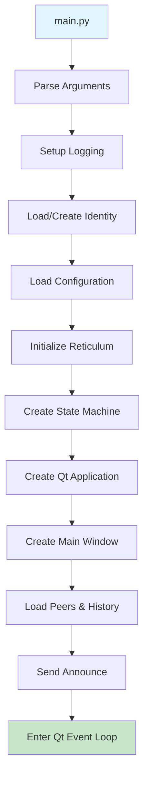
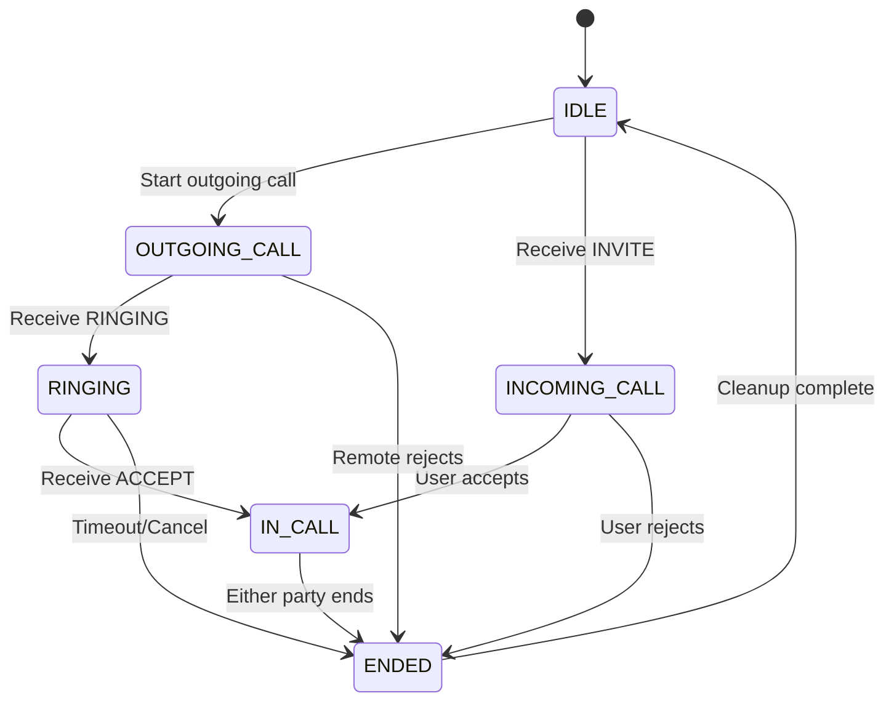
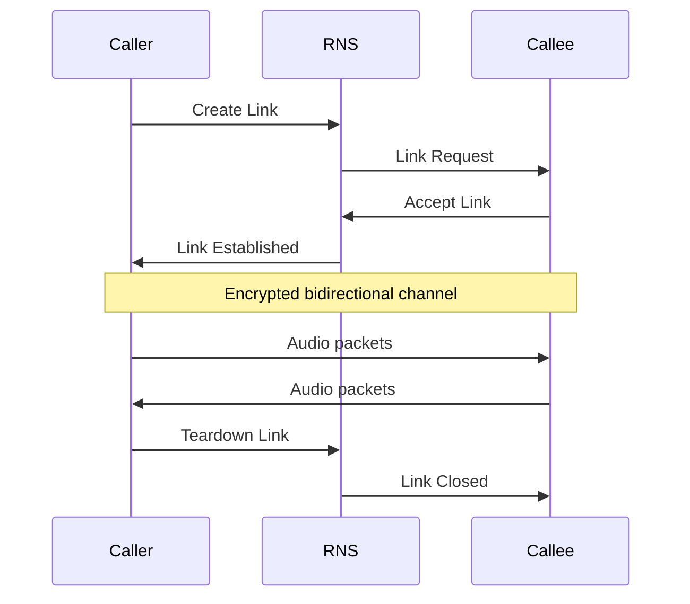
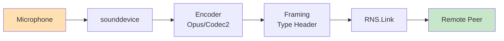
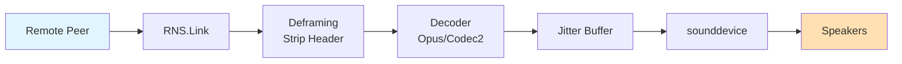
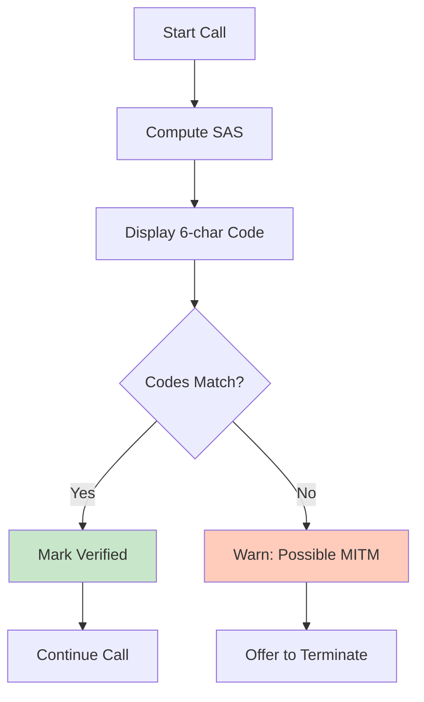
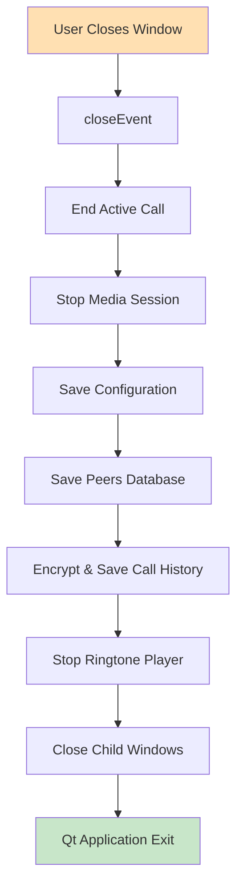
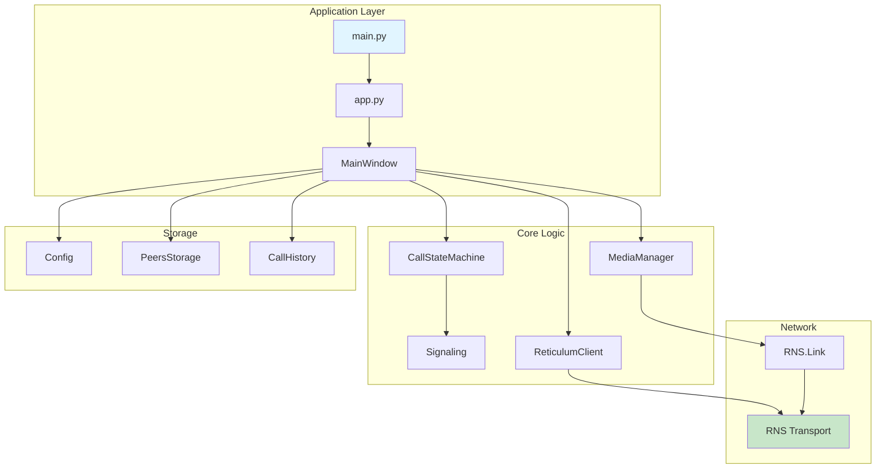

## Introduction

### Overview

LXST Phone is a proof-of-concept implementation of Voice over Reticulum (VoR), demonstrating how modern VoIP concepts can be adapted to operate over delay-tolerant, mesh-based networks. Unlike traditional VoIP systems that rely on SIP servers and PSTN integration, LXST Phone operates entirely peer-to-peer using cryptographic identities rather than phone numbers.

### Key Features

* **Decentralized Architecture**: No central servers, registrars, or authentication authorities
* **End-to-End Encryption**: All signaling and media encrypted using Reticulum's built-in cryptography
* **Identity-Based Addressing**: Cryptographic identities replace traditional phone numbers
* **Adaptive Codec Selection**: Automatic negotiation between Opus (high quality) and Codec2 (low bandwidth)
* **Peer Discovery**: Automatic discovery of other LXST Phone instances via network announces
* **Call History**: Encrypted local storage of call records with statistics
* **Security Features**: SAS verification, blocklists, and rate limiting

### Technology Stack

* **Networking**: Reticulum Network Stack (RNS)
* **GUI**: PySide6 (Qt for Python)
* **Audio Codecs**: Opus (via opuslib), Codec2 (via pycodec2)
* **Audio I/O**: sounddevice (PortAudio bindings)
* **Language**: Python 3.10+

### Document Structure

This document follows the application lifecycle:

1. **Program Startup**: Initialization, identity loading, and configuration
2. **Network Layer**: Reticulum integration and peer discovery
3. **Signaling**: Call state machine and message handling
4. **Media Layer**: Real-time audio streaming and codec management
5. **User Interface**: Qt-based GUI and user interactions
6. **Security**: Encryption, verification, and anti-abuse measures
7. **Shutdown**: Cleanup and graceful termination

---

## Program Startup

### Entry Point

The application entry point is `main.py`, which simply delegates to the `run_app()` function in `lxst_phone/app.py`.

```python
from lxst_phone.app import run_app

if __name__ == "__main__":
    raise SystemExit(run_app())
```

### Application Initialization Flow



The `run_app()` function orchestrates the startup sequence:

1. **Argument Parsing**: Process command-line arguments for configuration overrides
2. **Logging Setup**: Initialize structured logging system
3. **Identity Management**: Load or create cryptographic identity
4. **Configuration Loading**: Load user preferences from JSON config file
5. **Reticulum Initialization**: Start RNS transport and register announce handler
6. **State Machine Creation**: Initialize call state machine
7. **Qt Application**: Create QApplication and main window
8. **Network Announcement**: Optionally broadcast presence to network
9. **Event Loop**: Enter Qt main event loop

### Identity System

#### Identity Structure

Each LXST Phone instance has a unique cryptographic identity based on Ed25519 elliptic curve cryptography (via RNS). The identity consists of:

* **Private Key**: Stored locally, used for signing and decryption
* **Public Key**: Derived from private key, shared with peers
* **Node ID**: SHA-256 hash of public key (hex string), used as the "phone number"

#### Identity Storage

Identities are stored in `~/.lxst_phone/identity` by default. The file format is the RNS standard binary identity format. Users can:

* Create new identities with `--new-identity`
* Use alternate identity files with `--identity <path>`
* Export identities with password encryption
* Import identities from encrypted backups

### Configuration System

Configuration is managed by the `Config` class (`config.py`), which provides:

* **Persistent Storage**: JSON file at `~/.lxst_phone/config.json`
* **Hierarchical Settings**: Organized into categories (audio, codec, network, ui)
* **Type Safety**: Getter methods with type checking
* **Defaults**: Sensible defaults for all settings

Key configuration categories:

* **Audio**: Input/output devices, enable/disable, ringtone settings
* **Codec**: Codec type (Opus/Codec2), bitrate, sample rate, complexity
* **Network**: Jitter buffer size, announce settings
* **UI**: Window geometry, last called number, display name
* **Security**: Blocklist, rate limiting thresholds

---

## Network Layer

### Reticulum Integration

LXST Phone uses the Reticulum Network Stack for all network operations. RNS provides:

* **Transport Layer**: Routing over diverse physical media (TCP, UDP, LoRa, etc.)
* **Encryption**: Automatic encryption using Curve25519 + AES-128
* **Identity System**: Public key infrastructure without CAs
* **Link Abstraction**: Reliable, encrypted channels between peers

### Reticulum Client

The `ReticulumClient` class (`core/reticulum_client.py`) manages all RNS interactions:

#### Initialization

```python
class ReticulumClient:
    def __init__(self, identity: RNS.Identity, 
                 display_name: str = ""):
        self.node_identity = identity
        self.node_id = identity.hash.hex()
        self.display_name = display_name
        
        # Create signaling destination
        self.signaling_destination = RNS.Destination(
            identity,
            RNS.Destination.IN,
            RNS.Destination.SINGLE,
            "lxst_phone", "signaling"
        )
        
        # Register packet callback
        self.signaling_destination.set_packet_callback(
            self._on_packet_received
        )
```

#### Announce Handler

The `AnnounceHandler` class receives all network announces and filters for LXST Phone instances:

```python
class AnnounceHandler:
    def received_announce(self, destination_hash: bytes,
                         announced_identity: bytes,
                         app_data: bytes) -> None:
        # Parse app_data JSON
        data = json.loads(app_data.decode('utf-8'))
        
        # Filter for LXST Phone announces
        if data.get('app') != 'lxst_phone':
            return
        
        # Extract peer information
        display_name = data.get('display_name', '')
        node_id = identity.hash.hex()
        
        # Store in known_peers dictionary
        self.reticulum_client.known_peers[node_id] = (
            destination_hash.hex(),
            identity_key_b64
        )
```

### Peer Discovery


#### Presence Announcements

LXST Phone periodically broadcasts presence announces containing:

* **App Identifier**: `"lxst_phone"` to distinguish from other RNS apps
* **Display Name**: Human-readable name for the peer
* **Destination Hash**: Where to send signaling packets
* **Public Key**: For verification and encryption

Announce format (JSON in app_data field):

```json
{
    "app": "lxst_phone",
    "display_name": "Alice's Phone"
}
```

#### Peer Storage

Discovered peers are stored in two places:

1. **Runtime**: `known_peers` dictionary in ReticulumClient
2. **Persistent**: `PeersStorage` class saves to `~/.lxst_phone/peers.json`

Peer records include:

* Node ID (unique identifier)
* Display name
* Call destination hash
* Public key (base64)
* Verification status (unverified/verified/blocked)
* First seen timestamp
* Last seen timestamp

---

## Signaling Layer

### Call State Machine

The `CallStateMachine` class (`core/call_state.py`) manages call lifecycle with a simple finite state machine.

#### Call Phases

```python
class CallPhase(Enum):
    IDLE = auto()           # No active call
    OUTGOING_CALL = auto()  # We initiated, sent invite
    RINGING = auto()        # Remote acknowledged, ringing
    INCOMING_CALL = auto()  # We received invite, deciding
    IN_CALL = auto()        # Active call, media flowing
    ENDED = auto()          # Call ended, transitioning to IDLE
```

#### State Transitions



| Current State | Event | Next State |
|--------------|-------|------------|
| IDLE | Start outgoing call | OUTGOING_CALL |
| OUTGOING_CALL | Receive RINGING | RINGING |
| RINGING | Receive ACCEPT | IN_CALL |
| IDLE | Receive INVITE | INCOMING_CALL |
| INCOMING_CALL | User accepts | IN_CALL |
| IN_CALL | Either party ends | ENDED |
| ENDED | Cleanup complete | IDLE |

### Signaling Messages

#### Message Types

The `CallMessage` dataclass (`core/signaling.py`) defines the signaling protocol:

```python
CallMessageType = Literal[
    "CALL_INVITE",        # Initiate call
    "CALL_RINGING",       # Remote is alerting user
    "CALL_ACCEPT",        # Call accepted, provides media info
    "CALL_REJECT",        # Call declined
    "CALL_END",           # Terminate active call
    "PRESENCE_ANNOUNCE",  # Peer discovery (via announces)
]
```

#### Message Structure

```python
@dataclass
class CallMessage:
    msg_type: CallMessageType
    call_id: str              # UUID for this call
    from_id: str              # Sender's node ID
    to_id: str                # Recipient's node ID
    display_name: str | None  # Human-readable name
    call_dest: str | None     # Destination for media link
    call_identity_key: str    # Public key for media link
    codec_type: str | None    # "opus" or "codec2"
    codec_bitrate: int | None # Negotiated bitrate
    timestamp: float          # Unix timestamp
```

### Message Flow

#### Outgoing Call Sequence

1. **INVITE**: Caller sends to callee with codec preferences

```json
{
    "type": "CALL_INVITE",
    "call_id": "uuid-...",
    "from": "caller-node-id",
    "to": "callee-node-id",
    "codec_type": "opus",
    "codec_bitrate": 24000
}
```

2. **RINGING**: Callee acknowledges, alerting user

3. **ACCEPT**: Callee accepts, provides media destination

```json
{
    "type": "CALL_ACCEPT",
    "call_id": "uuid-...",
    "call_dest": "dest-hash",
    "call_identity_key": "base64-pubkey",
    "codec_type": "opus",
    "codec_bitrate": 24000
}
```

4. **Media Link**: Caller establishes RNS.Link to callee's media destination

5. **END**: Either party can terminate

### Message Filtering

The `CallMessageFilter` class (`core/message_filter.py`) provides:

* **Duplicate Suppression**: Ignore messages received within 1 second window
* **Validation**: Ensure messages are for current call
* **Foreign Call Rejection**: Ignore messages for unknown call IDs

### Codec Negotiation

Both peers specify their preferred codec and bitrate. The negotiation algorithm:

```python
def negotiate_codec(local_codec, local_bitrate,
                   remote_codec, remote_bitrate):
    # Prefer remote's choice if compatible
    if remote_codec in ["opus", "codec2"]:
        codec = remote_codec
        bitrate = remote_bitrate
    else:
        codec = local_codec
        bitrate = local_bitrate
    
    return codec, bitrate
```

This simple algorithm prefers the callee's codec choice, allowing them to optimize for their network conditions.

---

## Media Layer

### Media Session Architecture

The `MediaManager` singleton (`core/media.py`) manages active media sessions. Each call creates a `MediaSession` instance.

### RNS Link Establishment

#### Link Lifecycle

After call acceptance, a dedicated RNS.Link is established for media:



1. **Initiator**: Creates link to remote's call destination
2. **Responder**: Accepts inbound link request
3. **Establishment**: Link negotiates encryption keys
4. **Data Transfer**: Bidirectional encrypted channel
5. **Teardown**: Link closed on call end

#### Link Callbacks

```python
link.set_link_established_callback(
    self.on_link_established
)
link.set_packet_callback(
    self.on_media_packet_received
)
link.set_link_closed_callback(
    self.on_link_closed
)
```

### Audio Pipeline

#### Capture Pipeline



**Microphone → sounddevice → Encoder → Framing → RNS.Link**

```python
def audio_input_callback(indata, frames, time, status):
    # Convert to bytes
    pcm_data = (indata * 32767).astype(np.int16).tobytes()
    
    # Encode with Opus or Codec2
    encoded = encoder.encode(pcm_data, frame_size)
    
    # Frame with type header
    packet = struct.pack('B', PACKET_TYPE_AUDIO) + encoded
    
    # Send over RNS link
    RNS.Packet(link, packet).send()
```

#### Playback Pipeline



**RNS.Link → Deframing → Decoder → Jitter Buffer → sounddevice → Speakers**

```python
def audio_output_callback(outdata, frames, time, status):
    # Get frame from jitter buffer
    if jitter_buffer:
        encoded = jitter_buffer.pop()
        pcm_data = decoder.decode(encoded, frame_size)
        audio = np.frombuffer(pcm_data, dtype=np.int16)
        outdata[:] = (audio / 32767.0).reshape(-1, 1)
    else:
        # No data available, output silence
        outdata.fill(0)
```

### Codec Implementation

#### Opus Codec

Opus is a versatile codec designed for internet audio:

* **Bitrate Range**: 6-510 kbps (LXST uses 8-64 kbps)
* **Sample Rates**: 8, 12, 16, 24, 48 kHz (LXST uses 48 kHz)
* **Frame Sizes**: 2.5, 5, 10, 20, 40, 60 ms (LXST uses 20 ms)
* **Latency**: Very low (algorithm latency 5-66.5 ms)
* **Quality**: Excellent speech and music quality

```python
encoder = OpusEncoder(
    sample_rate=48000,
    channels=1,
    application=APPLICATION_AUDIO
)
encoder.bitrate = 24000  # 24 kbps
```

#### Codec2 Codec

Codec2 is a low-bitrate speech codec designed for low-bandwidth networks:

* **Modes**: 3200, 2400, 1600, 1400, 1300, 1200, 700C bps
* **Sample Rate**: 8 kHz
* **Frame Size**: 20-40 ms (mode-dependent)
* **Use Case**: HF radio, satellite links, mesh networks
* **Quality**: Intelligible speech at very low bitrates

```python
encoder = pycodec2.Codec2(pycodec2.MODE_3200)
# Automatically uses 8 kHz sample rate
```

### Jitter Buffer

The jitter buffer compensates for network timing variations:

* **Target Delay**: 60 ms (configurable)
* **Buffer Type**: Simple FIFO queue
* **Underrun Handling**: Output silence
* **Overrun Handling**: Drop oldest frames

### Packet Framing

Media packets include a type byte for multiplexing:

```python
PACKET_TYPE_AUDIO = 0x01    # Audio frame
PACKET_TYPE_PING = 0x02     # Keepalive/RTT measurement
PACKET_TYPE_CONTROL = 0x03  # Future: DTMF, etc.
```

Frame format: **[Type:1][Payload:N]**

---

## User Interface

### Main Window

The `MainWindow` class (`ui/main_window.py`) provides the primary user interface built with PySide6 (Qt).

### UI Components

#### Call Interface

* **Local Node ID Display**: Shows user's identifier
* **Remote Node ID Input**: Text field for entering callee's ID
* **Call Button**: Initiates outgoing call
* **Answer/Reject Buttons**: Respond to incoming calls
* **End Call Button**: Terminate active call

#### Status Display

* **Call State**: Current phase (Idle, Calling, Ringing, In Call)
* **Timer**: Call duration for active calls
* **Connection Status**: RNS transport health indicator
* **Network Quality**: Good/Fair/Poor based on metrics

#### Statistics Panel

Real-time metrics during calls:

* Round-trip time (RTT)
* Packet loss percentage
* Current bitrate (rx/tx)
* Jitter buffer size
* Link quality score

### Dialogs and Windows

#### Peers Window

* List of discovered peers
* Verification status indicators
* Quick-call functionality
* Peer management (block/unblock)

#### Call History Window

* Chronological list of past calls
* Call statistics (duration, quality metrics)
* Callback functionality
* Search and filtering

#### Security Dialogs

* **SAS Verification**: Short Authentication String dialog
* **Unverified Peer Warning**: Alert for unverified callers
* **Identity Export/Import**: Password-protected backup

### Event Handling

The UI uses Qt signals and slots for event-driven architecture:

```python
class MainWindow(QWidget):
    incomingCallMessage = Signal(object)
    
    def __init__(self):
        # Connect signal to slot
        self.incomingCallMessage.connect(
            self.handle_incoming_call_message
        )
        
        # Call state changes trigger UI updates
        self.call_state.on_state_changed = \
            self.on_call_state_changed
```

---

## Security

### Encryption

#### Transport Encryption

All network communication is encrypted by RNS:

* **Signaling**: Encrypted packets to signaling destination
* **Media**: RNS.Link provides AES-128 encrypted channel
* **Key Exchange**: Curve25519 ECDH
* **Authentication**: Ed25519 signatures

#### Identity Verification

Users can verify peer identities using Short Authentication Strings (SAS):



1. Both parties view the same 6-character code
2. Users compare codes out-of-band (voice, in person, etc.)
3. If codes match, peer is verified
4. Verification status persisted in peer storage

### Anti-Abuse Mechanisms

#### Rate Limiting

The `RateLimiter` class (`rate_limiter.py`) tracks calls per peer:

* **Per-Minute Limit**: 3 calls/minute per peer (default)
* **Per-Hour Limit**: 10 calls/hour per peer (default)
* **Automatic Rejection**: Exceeding limits auto-rejects calls
* **Sliding Window**: Old entries expire automatically

#### Blocklist

Users can block unwanted callers:

* Blocked peers stored in configuration
* Calls from blocked peers automatically rejected
* No notification sent to blocked peer
* Can be managed via Peers Window UI

### Call History Encryption

Call history is encrypted at rest:

* **Encryption Key**: Derived from user's RNS identity
* **Algorithm**: Fernet (AES-128 in CBC mode)
* **Storage**: `~/.lxst_phone/call_history.encrypted`
* **Access Control**: Only readable by identity owner

---

## Program Shutdown

### Cleanup Sequence



When the application exits, cleanup occurs in this order:

1. **Active Call Termination**: Send END message to remote peer
2. **Media Session Cleanup**:
    * Stop audio streams
    * Close RNS.Link
    * Release audio devices
3. **Persistent Data**:
    * Save configuration changes
    * Update peer database
    * Encrypt and save call history
4. **Reticulum Shutdown**:
    * Deregister announce handler
    * Close signaling destination
    * (RNS.Transport continues in background)
5. **UI Cleanup**:
    * Stop timers
    * Close child windows
    * Save window geometry
6. **Qt Application Exit**: Return to OS

### Graceful Shutdown Implementation

```python
def closeEvent(self, event) -> None:
    # End active call
    if self.call_state.current_call:
        self.on_end_call_clicked()
    
    # Save configuration
    self.config.window_geometry = (
        self.width(), self.height()
    )
    self.config.save()
    
    # Save peers
    self.peers_storage.save()
    
    # Save call history
    self.call_history.save()
    
    # Stop ringtone
    self.ringtone_player.cleanup()
    
    # Stop media
    media_mgr = media.MediaManager.get_instance()
    media_mgr.end_session()
    
    event.accept()
```

---

## Error Handling

### Network Errors

* **Link Timeout**: Automatic transition to ENDED state
* **Transport Failure**: Connection status indicator alerts user
* **Peer Unreachable**: Call ends after timeout (30s default)

### Audio Errors

* **Device Not Found**: Fallback to system default device
* **Stream Underrun**: Output silence, continue call
* **Codec Error**: Log error, attempt to continue with silence

### State Machine Errors

Invalid state transitions raise `RuntimeError` and are logged. The UI prevents most invalid transitions through button state management.

---

## Appendices

### Appendix A: Configuration File Format

Example `config.json`:

```json
{
  "audio": {
    "input_device": null,
    "output_device": null,
    "enabled": true,
    "ringtone_enabled": true,
    "ringtone_incoming": "incoming.wav",
    "ringtone_outgoing": "outgoing.wav"
  },
  "codec": {
    "type": "opus",
    "sample_rate": 48000,
    "frame_ms": 20,
    "channels": 1,
    "complexity": 10,
    "opus_bitrate": 24000,
    "codec2_mode": 3200
  },
  "network": {
    "target_jitter_ms": 60,
    "adaptive_jitter": false,
    "announce_on_start": true,
    "announce_period_minutes": 5
  },
  "ui": {
    "window_width": 620,
    "window_height": 550,
    "last_remote_id": "",
    "display_name": "My Phone"
  },
  "security": {
    "blocklist": [],
    "max_calls_per_minute": 3,
    "max_calls_per_hour": 10
  }
}
```

### Appendix B: Call Message Examples

#### CALL_INVITE Message

```json
{
  "type": "CALL_INVITE",
  "call_id": "550e8400-e29b-41d4-a716-446655440000",
  "from": "a1b2c3d4e5f6...",
  "to": "f6e5d4c3b2a1...",
  "display_name": "Alice",
  "codec_type": "opus",
  "codec_bitrate": 24000,
  "timestamp": 1700000000.0
}
```

#### CALL_ACCEPT Message

```json
{
  "type": "CALL_ACCEPT",
  "call_id": "550e8400-e29b-41d4-a716-446655440000",
  "from": "f6e5d4c3b2a1...",
  "to": "a1b2c3d4e5f6...",
  "display_name": "Bob",
  "call_dest": "9a8b7c6d5e4f...",
  "call_identity_key": "base64-encoded-key...",
  "codec_type": "opus",
  "codec_bitrate": 24000,
  "timestamp": 1700000001.5
}
```

### Appendix C: Architecture Diagram



**Key Components:**

* **main.py** → **app.py** (Entry point and initialization)
* **MainWindow** (Qt UI layer)
* **CallStateMachine** (State management)
* **ReticulumClient** (Network layer)
* **MediaManager/MediaSession** (Audio pipeline)
* **Config** (Persistent settings)
* **PeersStorage** (Peer database)
* **CallHistory** (Encrypted call records)

### Appendix D: Glossary

* **Node ID**: SHA-256 hash of an RNS identity's public key, used as a unique identifier
* **RNS**: Reticulum Network Stack - the underlying networking layer
* **Link**: An encrypted, reliable channel between two RNS identities
* **Destination**: An addressable endpoint in the RNS network
* **Announce**: A broadcast message advertising a destination's availability
* **SAS**: Short Authentication String - a code used for manual identity verification
* **Opus**: A high-quality audio codec (6-510 kbps)
* **Codec2**: A low-bitrate speech codec designed for HF radio (0.7-3.2 kbps)
* **Jitter Buffer**: A queue that compensates for variable network delays
* **VoR**: Voice over Reticulum - voice calling over the Reticulum network

---

## Conclusion

LXST Phone demonstrates that decentralized voice communication is feasible using modern mesh networking technologies. By building on Reticulum's robust cryptographic foundation and implementing proven VoIP concepts, it provides a working proof-of-concept for serverless, peer-to-peer voice calls.

The modular architecture separates concerns cleanly: the state machine manages call logic, the media layer handles real-time audio, the network layer provides transport, and the UI presents a familiar interface. This separation allows for independent testing and future enhancements.

Key architectural decisions include:

* Using RNS.Link for media ensures encryption without additional complexity
* Supporting both Opus and Codec2 allows optimization for different network conditions
* The simple state machine prevents race conditions and invalid transitions
* Persistent storage with encryption protects user privacy
* Rate limiting and blocklists provide basic DoS protection

Future development should focus on scalability (group calls), reliability (adaptive jitter buffers), and usability (better peer discovery UX). The foundation is solid and extensible.
