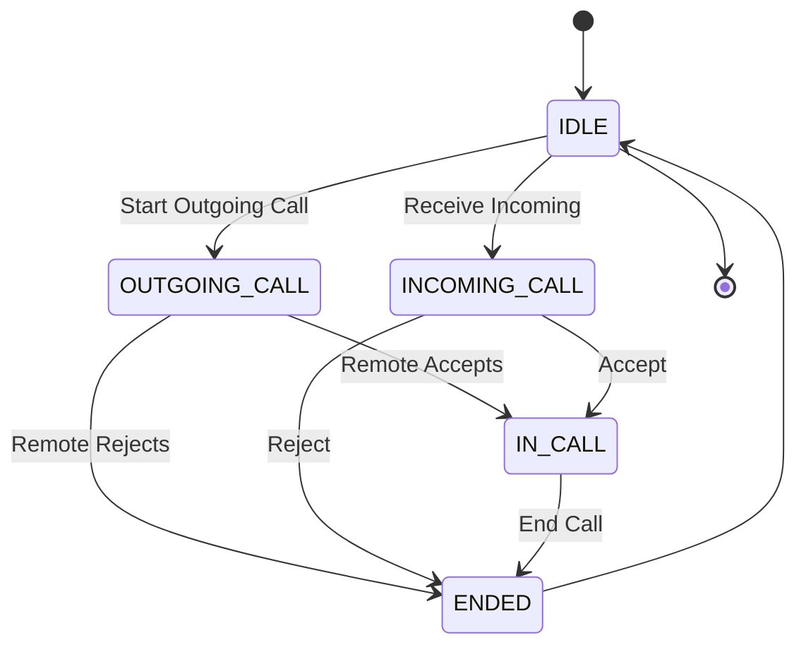
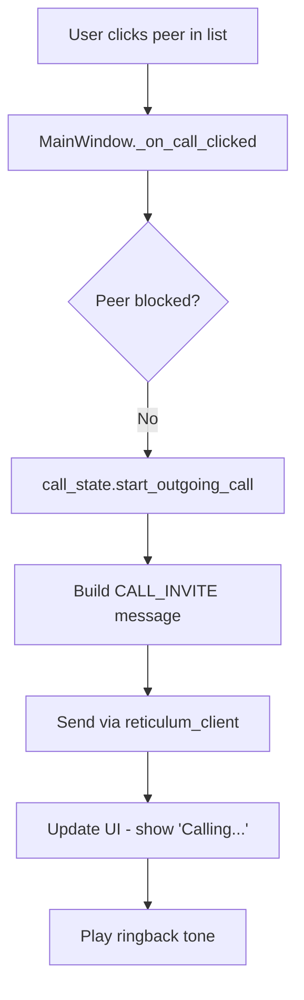
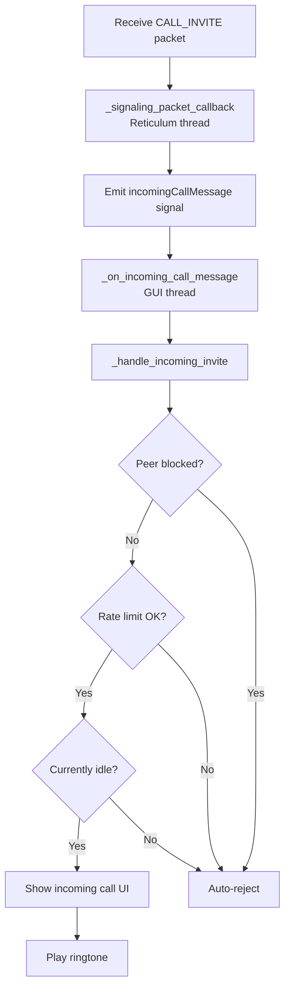
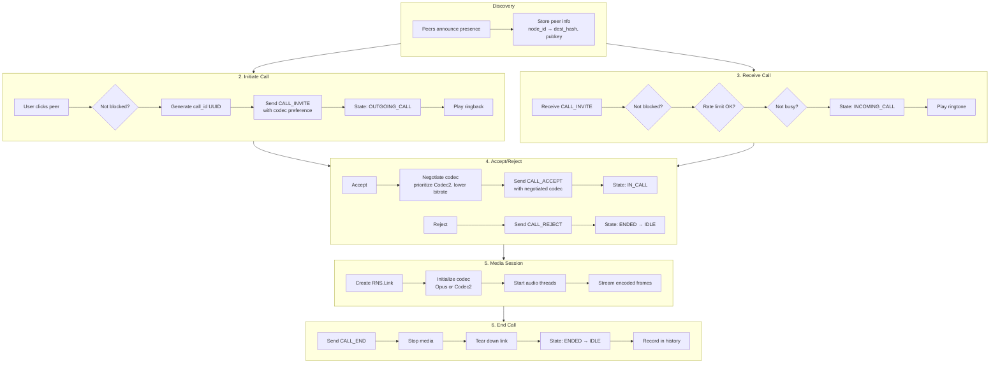

# Call Management, Rate Limiting, and Codec Negotiation

This document explains how LXST Phone manages the complete call lifecycle, from initiating a call through acceptance, including protection mechanisms and codec selection.

## Call Lifecycle Overview



## Call State Machine

### CallPhase Enum

Location: `lxst_phone/core/call_state.py`

```python
class CallPhase(Enum):
    IDLE = auto()           # No active call
    OUTGOING_CALL = auto()  # We initiated, waiting for response
    RINGING = auto()        # Remote is being alerted (optional state)
    INCOMING_CALL = auto()  # We received invite, not yet accepted
    IN_CALL = auto()        # Active call with media flowing
    ENDED = auto()          # Call ended, transitioning to IDLE
```

### CallInfo Dataclass

Stores all information about the current call:

```python
@dataclass
class CallInfo:
    call_id: str                              # UUID for this call
    local_id: str                             # Our node ID
    remote_id: str                            # Peer's node ID
    display_name: Optional[str] = None        # Peer's display name
    initiated_by_local: bool = False          # True if we called them
    remote_call_dest: Optional[str] = None    # Peer's destination hash
    remote_identity_key: Optional[str] = None # Peer's public key (base64)
    negotiated_codec_type: Optional[str] = None    # "opus" or "codec2"
    negotiated_codec_bitrate: Optional[int] = None # Bitrate in bps
```

### CallStateMachine Class

Pure state logic with no dependencies on networking or UI:

```python
class CallStateMachine:
    def __init__(self) -> None:
        self.phase: CallPhase = CallPhase.IDLE
        self.current_call: Optional[CallInfo] = None
        self.on_state_changed: Optional[
            Callable[[CallPhase, Optional[CallInfo]], None]
        ] = None
```

**Design principle:** State machine is pure logic. UI and networking layers register callbacks.

## Starting an Outgoing Call

### User Action Flow



### Implementation Details

Location: `lxst_phone/ui/main_window.py`

```python
def _on_call_clicked(self):
    """Handle call button click."""
    peer_table = self.peers_window.peer_table
    selected = peer_table.currentRow()
    
    if selected < 0:
        QMessageBox.warning(self, "No Selection", "Select a peer first.")
        return
    
    # Get destination hash from table
    dest_item = peer_table.item(selected, 2)
    if not dest_item:
        return
    
    dest = dest_item.text()
    
    # Check if peer is blocked
    if self.peers_storage.is_blocked(dest):
        QMessageBox.information(
            self,
            "Blocked Peer",
            f"This peer is blocked: {dest[:24]}...\n\n"
            "Unblock them in the Peers window to make calls.",
        )
        return
    
    # Find peer info
    peer_info = self.reticulum_client.known_peers.get(dest)
    if not peer_info:
        QMessageBox.warning(
            self, "Unknown Peer", "Cannot find destination info for this peer."
        )
        return
    
    call_dest_hash, call_identity_key = peer_info
    
    # Get peer record for display name
    peer = self.peers_storage.get_peer(dest)
    display_name = peer.display_name if peer else "Unknown"
```

### Starting the Call State

```python
    # Start call in state machine
    call = self.call_state.start_outgoing_call(
        local_id=self.local_id,
        remote_id=dest,
        call_id=None,  # Will generate new UUID
    )
    
    # Store remote peer information
    call.remote_call_dest = call_dest_hash
    call.remote_identity_key = call_identity_key
    call.display_name = display_name
```

**Key point:** `start_outgoing_call()` generates a new call_id (UUID) and validates state:

```python
def start_outgoing_call(
    self, local_id: str, remote_id: str, call_id: Optional[str] = None
) -> CallInfo:
    if self.phase not in (CallPhase.IDLE, CallPhase.ENDED):
        raise RuntimeError("Cannot start a new call while another call is active.")
    
    call = CallInfo(
        call_id=call_id or new_call_id(),  # UUID v4
        local_id=local_id,
        remote_id=remote_id,
        initiated_by_local=True,
    )
    self.current_call = call
    self._set_state(CallPhase.OUTGOING_CALL)
    return call
```

### Codec Selection

Location: `lxst_phone/ui/main_window.py`

```python
    # Get codec preference from config
    codec_type = self.config.codec_type  # "opus" or "codec2"
    
    if codec_type == "opus":
        codec_bitrate = self.config.opus_bitrate  # e.g., 24000
    elif codec_type == "codec2":
        codec_bitrate = self.config.codec2_mode   # e.g., 3200
    else:
        codec_type = "opus"
        codec_bitrate = 24000  # Default fallback
    
    call.negotiated_codec_type = codec_type
    call.negotiated_codec_bitrate = codec_bitrate
```

**Configuration options:**

Opus bitrates:

* 6000 - 512000 bps (very wide range)
* Typical: 24000 bps (good quality, low bandwidth)
* High quality: 64000 bps

Codec2 modes (mode = bitrate):

* 3200 bps - Highest quality
* 2400 bps - Good quality
* 1600 bps - Acceptable quality
* 1400 bps - Lower quality
* 700 bps - Minimal (radio conditions)

### Building and Sending INVITE

```python
    # Build CALL_INVITE message
    from lxst_phone.core.signaling import build_invite
    
    invite_msg = build_invite(
        from_id=self.local_id,
        to_id=dest,
        display_name=self.config.display_name,  # Our name
        call_dest=self.reticulum_client.call_dest_hash,  # Where to send media
        call_identity_key=self.reticulum_client.identity_key_b64(),  # Our pubkey
        codec_type=codec_type,
        codec_bitrate=codec_bitrate,
        call_id=call.call_id,
    )
    
    try:
        self.reticulum_client.send_call_message(invite_msg)
        logger.info(f"Sent CALL_INVITE to {dest[:16]}... with codec {codec_type}")
    except Exception as exc:
        logger.error(f"Failed to send invite: {exc}")
        QMessageBox.critical(self, "Error", f"Failed to send invite: {exc}")
        self.call_state.end_call()
        return
```

### UI Updates

```python
    # Update UI
    self.append_event(f"Calling {display_name}...")
    self.status_label.setText(f"Calling {display_name}...")
    
    # Update buttons
    self._update_call_buttons()  # Disable Call, enable End
    
    # Play ringback tone
    self._play_ringback()
```

## Receiving an Incoming Call

### Receive Flow



### Peer Blocking

Location: `lxst_phone/ui/main_window.py`

```python
def _handle_incoming_invite(self, msg: CallMessage):
    """Process incoming call invitation."""
    remote_id = msg.from_id
    call_id = msg.call_id
    
    # Check if peer is blocked
    if self.peers_storage.is_blocked(remote_id):
        logger.info(
            f"Auto-rejecting call from blocked peer: {remote_id[:16]}..."
        )
        self.append_event(f"Blocked peer {remote_id[:16]}... - auto-rejected")
        
        # Send REJECT immediately
        reject_msg = build_reject(
            from_id=self.local_id,
            to_id=remote_id,
            call_id=call_id
        )
        try:
            self.reticulum_client.send_call_message(reject_msg)
        except Exception as exc:
            logger.error(f"Failed to send reject to blocked peer: {exc}")
        return
```

**Blocking implementation:**

Location: `lxst_phone/peers_storage.py`

```python
class PeerRecord:
    def __init__(self, ...):
        ...
        self.blocked: bool = False  # Is this peer blocked?

class PeersStorage:
    def block_peer(self, node_id: str) -> None:
        """Block a peer (auto-reject their calls)."""
        if node_id in self.peers:
            self.peers[node_id].blocked = True
            self.save()
            logger.info(f"Blocked peer {node_id[:16]}...")
    
    def unblock_peer(self, node_id: str) -> None:
        """Unblock a peer."""
        if node_id in self.peers:
            self.peers[node_id].blocked = False
            self.save()
            logger.info(f"Unblocked peer {node_id[:16]}...")
    
    def is_blocked(self, node_id: str) -> bool:
        """Check if a peer is blocked."""
        if node_id in self.peers:
            return self.peers[node_id].blocked
        return False
```

**User interface:**

* Peers window has "Block" / "Unblock" buttons
* Blocked status shown in peer list
* Blocking persists across restarts (saved to peers.json)

### Rate Limiting

Location: `lxst_phone/rate_limiter.py`

```python
class RateLimiter:
    """
    Rate limiter for incoming calls.
    
    Tracks call attempts per peer and enforces configurable limits.
    """
    
    def __init__(
        self,
        max_calls_per_minute: int = 5,
        max_calls_per_hour: int = 20,
        window_cleanup_interval: int = 300,
    ):
        self.max_calls_per_minute = max_calls_per_minute
        self.max_calls_per_hour = max_calls_per_hour
        self.window_cleanup_interval = window_cleanup_interval
        
        # Store timestamps of call attempts per peer
        self.call_timestamps: Dict[str, deque[float]] = {}
```

**Default limits:**

* 5 calls per minute from same peer
* 20 calls per hour from same peer
* Cleanup old entries every 5 minutes

**Rate limiting logic:**

```python
def is_allowed(self, peer_id: str) -> bool:
    """
    Check if a call from this peer is allowed.
    """
    now = time.time()
    
    # Create entry for new peer
    if peer_id not in self.call_timestamps:
        self.call_timestamps[peer_id] = deque()
    
    timestamps = self.call_timestamps[peer_id]
    
    # Calculate time windows
    minute_cutoff = now - 60.0
    hour_cutoff = now - 3600.0
    
    # Remove timestamps older than 1 hour
    while timestamps and timestamps[0] < hour_cutoff:
        timestamps.popleft()
    
    # Count calls in time windows
    calls_in_minute = sum(1 for ts in timestamps if ts >= minute_cutoff)
    calls_in_hour = len(timestamps)
    
    # Check minute limit
    if calls_in_minute >= self.max_calls_per_minute:
        logger.warning(
            f"Rate limit exceeded for {peer_id[:16]}...: "
            f"{calls_in_minute} calls in last minute (limit: {self.max_calls_per_minute})"
        )
        return False
    
    # Check hour limit
    if calls_in_hour >= self.max_calls_per_hour:
        logger.warning(
            f"Rate limit exceeded for {peer_id[:16]}...: "
            f"{calls_in_hour} calls in last hour (limit: {self.max_calls_per_hour})"
        )
        return False
    
    # All checks passed, record this attempt
    timestamps.append(now)
    return True
```

**Rate limit check in call handling:**

```python
# In _handle_incoming_invite()
if not self.rate_limiter.is_allowed(remote_id):
    logger.warning(
        f"Rate limit exceeded for {remote_id[:16]}..., rejecting call"
    )
    self.append_event(
        f"Rate limited call from {remote_id[:16]}... - auto-rejected"
    )
    
    # Send REJECT
    reject_msg = build_reject(
        from_id=self.local_id,
        to_id=remote_id,
        call_id=call_id
    )
    try:
        self.reticulum_client.send_call_message(reject_msg)
    except Exception as exc:
        logger.error(f"Failed to send rate limit reject: {exc}")
    return
```

**Benefits:**
    
* Prevents DoS attacks (spam calls)
* Protects against buggy clients
* Configurable per-instance
* Transparent to legitimate users

### Busy Check

```python
# Check if we're already in a call
if self.call_state.phase not in (CallPhase.IDLE, CallPhase.ENDED):
    logger.info(f"Busy, rejecting call from {remote_id[:16]}...")
    
    # Send REJECT
    reject_msg = build_reject(
        from_id=self.local_id,
        to_id=remote_id,
        call_id=call_id
    )
    try:
        self.reticulum_client.send_call_message(reject_msg)
    except Exception as exc:
        logger.error(f"Failed to send busy reject: {exc}")
    return
```

**Note:** Future enhancement could be call waiting instead of auto-reject.

### Accepting Incoming Call

If all checks pass:

```python
# Create call info
call = CallInfo(
    call_id=call_id,
    local_id=self.local_id,
    remote_id=remote_id,
    display_name=msg.display_name,
    initiated_by_local=False,  # They called us
    remote_call_dest=msg.call_dest,
    remote_identity_key=msg.call_identity_key,
    negotiated_codec_type=msg.codec_type,
    negotiated_codec_bitrate=msg.codec_bitrate,
)

# Update state machine
success = self.call_state.receive_incoming_invite(call)
if success:
    self.append_event(
        f"Incoming call from {msg.display_name or remote_id[:16]}..."
    )
    
    # Update UI
    self.status_label.setText(
        f"Incoming call from {msg.display_name or remote_id[:16]}..."
    )
    self._update_call_buttons()  # Show Accept/Reject
    
    # Play ringtone
    self._play_ringtone()
```

## Codec Negotiation

### Negotiation Algorithm

Location: `lxst_phone/core/signaling.py`

```python
def negotiate_codec(
    local_codec: str,
    local_bitrate: int,
    remote_codec: str | None,
    remote_bitrate: int | None,
) -> tuple[str, int]:
    """
    Negotiate codec settings between two peers.
    
    Returns (codec_type, bitrate) to use for the call.
    
    Rules:
    1. If remote doesn't specify, use local settings
    2. Codec2 takes priority over Opus (lower bandwidth)
    3. Within same codec, use lower bitrate
    """
    if remote_codec is None or remote_bitrate is None:
        return (local_codec, local_bitrate)
    
    local_bps = normalize_codec_bitrate(local_codec, local_bitrate)
    remote_bps = normalize_codec_bitrate(remote_codec, remote_bitrate)
    
    # Codec2 always wins (bandwidth conservation for mesh networks)
    if local_codec == "codec2" and remote_codec == "opus":
        return (local_codec, local_bitrate)
    elif remote_codec == "codec2" and local_codec == "opus":
        return (remote_codec, remote_bitrate)
    
    # Same codec: choose lower bitrate
    if local_bps <= remote_bps:
        return (local_codec, local_bitrate)
    else:
        return (remote_codec, remote_bitrate)
```

### Bitrate Normalization

```python
def normalize_codec_bitrate(codec_type: str, bitrate_or_mode: int) -> int:
    """
    Normalize codec bitrate to a common scale for comparison.
    
    For Opus: bitrate is already in bps
    For Codec2: mode IS the bitrate in bps
    
    Returns bitrate in bps.
    """
    if codec_type == "opus":
        return bitrate_or_mode
    elif codec_type == "codec2":
        return bitrate_or_mode  # Mode value = bitrate
    else:
        return 24000  # Default fallback
```

**Why this matters:**

* Opus uses arbitrary bitrate values (6000-512000 bps)
* Codec2 uses fixed "modes" which ARE bitrates (700, 1400, 1600, 2400, 3200)
* Normalization allows comparing across codec types

### Negotiation Examples

**Example 1: Both prefer Opus**
```
Alice: Opus @ 24000 bps
Bob:   Opus @ 32000 bps
Result: Opus @ 24000 bps (lower bitrate wins)
```

**Example 2: Mixed codecs**
```
Alice: Opus @ 24000 bps
Bob:   Codec2 @ 3200 bps
Result: Codec2 @ 3200 bps (Codec2 always wins for mesh efficiency)
```

**Example 3: Both prefer Codec2**
```
Alice: Codec2 @ 3200 bps
Bob:   Codec2 @ 2400 bps
Result: Codec2 @ 2400 bps (lower bitrate wins)
```

### When Negotiation Happens

**Outgoing call:**

1. Alice sends INVITE with her preference (Opus 24000)
2. Bob receives, negotiates (Codec2 3200 wins)
3. Bob sends ACCEPT with negotiated codec (Codec2 3200)
4. Alice receives ACCEPT, updates call state
5. Both create MediaManager with Codec2 @ 3200

**Implementation in _handle_call_accept():**

```python
def _handle_call_accept(self, msg: CallMessage):
    """Handle remote peer accepting our call."""
    if not self.current_call or self.current_call.call_id != msg.call_id:
        logger.warning("Received ACCEPT for unknown call")
        return
    
    # Update call info with negotiated codec
    if msg.codec_type and msg.codec_bitrate:
        self.current_call.negotiated_codec_type = msg.codec_type
        self.current_call.negotiated_codec_bitrate = msg.codec_bitrate
        logger.info(
            f"Codec negotiated: {msg.codec_type} @ {msg.codec_bitrate} bps"
        )
    
    # Store remote info
    if msg.call_dest:
        self.current_call.remote_call_dest = msg.call_dest
    if msg.call_identity_key:
        self.current_call.remote_identity_key = msg.call_identity_key
    
    # Update state
    self.call_state.mark_remote_accepted(
        call_id=msg.call_id,
        remote_call_dest=msg.call_dest,
        remote_identity_key=msg.call_identity_key,
    )
```

## Accepting a Call

### User Clicks "Accept"

```python
def _on_accept_clicked(self):
    """Handle accept button click."""
    if self.call_state.phase != CallPhase.INCOMING_CALL:
        logger.warning("Accept clicked but no incoming call")
        return
    
    if not self.call_state.current_call:
        return
    
    call = self.call_state.current_call
    
    # Perform codec negotiation
    from lxst_phone.core.signaling import negotiate_codec
    
    local_codec = self.config.codec_type
    local_bitrate = (
        self.config.opus_bitrate 
        if local_codec == "opus" 
        else self.config.codec2_mode
    )
    
    negotiated_codec, negotiated_bitrate = negotiate_codec(
        local_codec=local_codec,
        local_bitrate=local_bitrate,
        remote_codec=call.negotiated_codec_type,
        remote_bitrate=call.negotiated_codec_bitrate,
    )
    
    # Update call with negotiated codec
    call.negotiated_codec_type = negotiated_codec
    call.negotiated_codec_bitrate = negotiated_bitrate
    
    logger.info(
        f"Negotiated codec: {negotiated_codec} @ {negotiated_bitrate} bps"
    )
    
    # Build ACCEPT message
    from lxst_phone.core.signaling import build_accept
    
    accept_msg = build_accept(
        from_id=self.local_id,
        to_id=call.remote_id,
        call_id=call.call_id,
        call_dest=self.reticulum_client.call_dest_hash,
        call_identity_key=self.reticulum_client.identity_key_b64(),
        codec_type=negotiated_codec,
        codec_bitrate=negotiated_bitrate,
    )
    
    try:
        self.reticulum_client.send_call_message(accept_msg)
        logger.info(f"Sent CALL_ACCEPT to {call.remote_id[:16]}...")
    except Exception as exc:
        logger.error(f"Failed to send accept: {exc}")
        QMessageBox.critical(self, "Error", f"Failed to send accept: {exc}")
        self.call_state.reject_current_call()
        return
    
    # Update state machine
    self.call_state.accept_current_call()
    
    # Stop ringtone
    self._stop_ringtone()
    
    # Update UI
    self.append_event(f"Accepted call from {call.display_name or call.remote_id[:16]}...")
    self.status_label.setText("In call...")
    self._update_call_buttons()
```

## Rejecting a Call

### User Clicks "Reject"

```python
def _on_reject_clicked(self):
    """Handle reject button click."""
    if self.call_state.phase != CallPhase.INCOMING_CALL:
        return
    
    if not self.call_state.current_call:
        return
    
    call = self.call_state.current_call
    
    # Build REJECT message
    from lxst_phone.core.signaling import build_reject
    
    reject_msg = build_reject(
        from_id=self.local_id,
        to_id=call.remote_id,
        call_id=call.call_id,
    )
    
    try:
        self.reticulum_client.send_call_message(reject_msg)
        logger.info(f"Sent CALL_REJECT to {call.remote_id[:16]}...")
    except Exception as exc:
        logger.error(f"Failed to send reject: {exc}")
    
    # Update state
    self.call_state.reject_current_call()
    
    # Stop ringtone
    self._stop_ringtone()
    
    # Update UI
    self.append_event(f"Rejected call from {call.display_name or call.remote_id[:16]}...")
    self.status_label.setText("Ready")
    self._update_call_buttons()
```

## Starting Media Session

After ACCEPT is sent/received, media session begins:

### Media Session Initiation

Location: `lxst_phone/ui/main_window.py` in state change handler:

```python
def _on_state_changed(self, phase: CallPhase, call: Optional[CallInfo]):
    """Handle call state changes."""
    logger.debug(f"Call state changed to {phase}")
    
    if phase == CallPhase.IN_CALL and call:
        # Call is now active, start media
        self._start_media_session(call)
    elif phase == CallPhase.IDLE:
        # Call ended, stop media
        self._stop_media_session()
```

### Starting Media

```python
def _start_media_session(self, call: CallInfo):
    """Start media session for active call."""
    from lxst_phone.core.media import MediaManager
    
    manager = MediaManager.get_instance()
    
    codec_type = call.negotiated_codec_type or "opus"
    codec_bitrate = call.negotiated_codec_bitrate or 24000
    
    # Map codec_bitrate to appropriate parameter
    if codec_type == "opus":
        opus_bitrate = codec_bitrate
        codec2_mode = 3200  # Unused
    else:
        opus_bitrate = 24000  # Unused
        codec2_mode = codec_bitrate
    
    try:
        manager.start_session(
            call_info=call,
            reticulum_client=self.reticulum_client,
            audio_input_device=self.audio_input_device,
            audio_output_device=self.audio_output_device,
            audio_enabled=self.audio_enabled,
            codec_type=codec_type,
            opus_bitrate=opus_bitrate,
            opus_complexity=10,  # Max quality
            codec2_mode=codec2_mode,
        )
        logger.info(f"Started media session with codec {codec_type}")
    except Exception as exc:
        logger.error(f"Failed to start media session: {exc}")
        QMessageBox.critical(self, "Error", f"Failed to start audio: {exc}")
        self.end_call()
```

**What MediaManager does:**

1. Creates RNS.Link for voice data (separate from signaling)
2. Initializes codec (Opus or Codec2)
3. Starts audio capture thread
4. Starts audio playback thread
5. Begins streaming encoded audio frames

## Ending a Call

### User Clicks "End Call"

```python
def _on_end_call_clicked(self):
    """Handle end call button click."""
    if not self.call_state.current_call:
        return
    
    call = self.call_state.current_call
    
    # Build CALL_END message
    from lxst_phone.core.signaling import build_end
    
    end_msg = build_end(
        from_id=self.local_id,
        to_id=call.remote_id,
        call_id=call.call_id,
    )
    
    try:
        self.reticulum_client.send_call_message(end_msg)
        logger.info(f"Sent CALL_END to {call.remote_id[:16]}...")
    except Exception as exc:
        logger.error(f"Failed to send end: {exc}")
    
    # End call locally
    self.call_state.end_call()
    
    # Update UI
    self.append_event("Call ended")
    self.status_label.setText("Ready")
    self._update_call_buttons()
    
    # Record in call history
    self._record_call_history(call, "completed")
```

### Receiving CALL_END

```python
def _handle_call_end(self, msg: CallMessage):
    """Handle remote ending the call."""
    if not self.call_state.current_call:
        return
    
    if self.call_state.current_call.call_id != msg.call_id:
        logger.warning("Received END for wrong call_id")
        return
    
    # Update state
    self.call_state.remote_ended(msg.call_id)
    
    # Update UI
    self.append_event("Remote ended call")
    self.status_label.setText("Ready")
    self._update_call_buttons()
    
    # Record in history
    if self.call_state.current_call:
        self._record_call_history(
            self.call_state.current_call, 
            "completed"
        )
```

## Call History Recording

### Recording Calls

Location: `lxst_phone/call_history.py`

```python
class CallHistory:
    def add_call(
        self,
        call_id: str,
        remote_id: str,
        display_name: str,
        direction: str,  # "outgoing" or "incoming"
        outcome: str,    # "completed", "rejected", "missed"
        duration: int = 0,  # seconds
    ) -> None:
        """Add a call to the history."""
```

**When calls are recorded:**

1. **Completed calls** - When either party ends an active call
2. **Rejected calls** - When incoming call is rejected
3. **Missed calls** - When we're busy and auto-reject

**Database schema:**
```sql
CREATE TABLE calls (
    id INTEGER PRIMARY KEY,
    call_id TEXT UNIQUE,
    remote_id TEXT,
    display_name TEXT,
    direction TEXT,     -- 'outgoing' or 'incoming'
    outcome TEXT,       -- 'completed', 'rejected', 'missed'
    duration INTEGER,   -- seconds
    timestamp REAL      -- Unix timestamp
)
```

**Encryption:** Call history can be encrypted with a user password (optional feature).

## Summary

### Call Flow Complete Picture



### Protection Mechanisms

**Blocking:**

* User-controlled blacklist
* Persists across restarts
* Auto-rejects with CALL_REJECT

**Rate Limiting:**

* 5 calls/minute per peer
* 20 calls/hour per peer
* Transparent to normal users
* Prevents DoS attacks

**Busy Handling:**

* Only one call at a time
* Auto-reject with CALL_REJECT when busy
* Future: Could implement call waiting

### Codec Strategy

**Design goals:**

1. Bandwidth efficiency (mesh networks)
2. Quality when bandwidth available
3. Automatic negotiation (no manual config)

**Priorities:**

1. Codec2 > Opus (bandwidth)
2. Lower bitrate > Higher bitrate (reliability)
3. Caller's preference if tie
