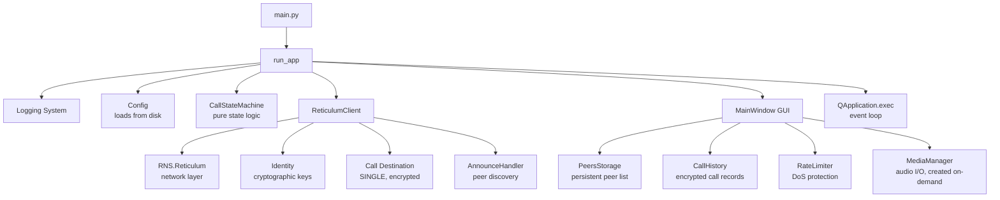

# Program Startup and Initialization

This document explains the complete startup sequence for LXST Phone, from command-line argument parsing through component initialization.

## Entry Point

The program starts from `main.py`:

```python
from lxst_phone.app import run_app

if __name__ == "__main__":
    raise SystemExit(run_app())
```

This immediately delegates to `run_app()` in `app.py`, which contains all initialization logic.

## Command-Line Argument Parsing

LXST Phone uses Python's `argparse` module to handle a comprehensive set of command-line options:

### Identity and Security Arguments

* `--identity PATH` - Specify custom identity file location (default: `~/.lxst_phone/identity`)
* `--new-identity` - Force creation of a new identity, replacing any existing one
* `--show-identity` - Display identity information (node ID, public key) and exit

### Audio Configuration

* `--audio-input-device INDEX` - Specify audio input device index
* `--audio-output-device INDEX` - Specify audio output device index
* `--no-audio` - Disable audio entirely (useful for testing multiple instances)

### Presence Announcements

* `--no-announce` - Disable automatic presence announcements
* `--announce-period MINUTES` - Set announcement interval (default: 5 minutes)
* `--display-name NAME` - Set display name for presence announcements

### Logging

* `--log-level LEVEL` - Set logging level (DEBUG, INFO, WARNING, ERROR, CRITICAL)
* `--log-file PATH` - Specify custom log file path
* `--no-log-file` - Disable file logging

### Development/Testing

* `--simulate-incoming` - Simulate an incoming call after startup
* `--simulate-delay-ms MS` - Delay before simulated call (default: 800ms)
* `--simulate-remote-id ID` - Remote ID to use for simulated call

## Initialization Sequence

### 1. Logging Setup

```python
log_file = None
if not args.no_log_file:
    if args.log_file:
        log_file = Path(args.log_file)
    else:
        log_file = get_default_log_file()  # ~/.lxst_phone/logs/lxst_phone.log

setup_logging(
    level=args.log_level,
    log_file=log_file,
    console=True,
)
```

**What happens:**

* If logging to file is enabled (default), creates log directory `~/.lxst_phone/logs/`
* Configures Python's logging system with specified level
* Sets up dual output: console and rotating file handler
* All modules use `get_logger(__name__)` to access configured loggers

### 2. Resource Initialization

```python
from lxst_phone.ringtone import copy_default_ringtones
copy_default_ringtones()
```

**What happens:**

* Checks if ringtone directory exists: `~/.lxst_phone/ringtones/`
* If missing, copies default ringtones from package resources
* Ensures users have ringtone files available for incoming calls

### 3. Identity Handling

```python
identity_path = Path(args.identity) if args.identity else None

if args.show_identity:
    identity = load_or_create_identity(identity_path=identity_path)
    info = get_identity_info(identity)
    # Display and exit
```

**Special mode:** If `--show-identity` is specified, the program:

1. Loads or creates the identity
2. Displays the node ID and public key
3. Exits immediately without starting the GUI

**Normal startup:** Identity is loaded later during Reticulum initialization.

### 4. Qt Application Setup

```python
qt_argv = [sys.argv[0]] + qt_args
app = QApplication(qt_argv)
```

**What happens:**

* Any unrecognized arguments are passed to Qt (enables Qt-specific flags like `-platform wayland`)
* Creates the Qt application instance required for GUI

### 5. Configuration Loading

```python
config = Config()
```

**What happens:**

* Loads saved configuration from `~/.lxst_phone/config.json`
* If file doesn't exist, creates with defaults
* Configuration includes:
    * Audio device indices
    * Audio enabled/disabled state
    * Display name
    * Announcement settings
    * Call history encryption settings

### 6. Audio Device Configuration

```python
audio_input = (
    args.audio_input_device
    if args.audio_input_device is not None
    else config.audio_input_device
)
audio_output = (
    args.audio_output_device
    if args.audio_output_device is not None
    else config.audio_output_device
)
audio_enabled = (not args.no_audio) and config.audio_enabled
```

**Priority:** Command-line arguments override saved config values.

**Persistence:** If audio devices are specified on command line, they're saved to config:

```python
if args.audio_input_device is not None:
    config.audio_input_device = args.audio_input_device
    config.save()
```

### 7. Announcement Configuration

```python
announce_on_start = (
    (not args.no_announce) if args.no_announce else config.announce_on_start
)
announce_period_minutes = (
    args.announce_period
    if args.announce_period is not None
    else config.announce_period_minutes
)
display_name = (
    args.display_name if args.display_name is not None else config.display_name
)
```

**What happens:**

* Determines whether to announce presence on startup
* Sets the periodic announcement interval
* Configures the display name to broadcast

### 8. Call State Machine Initialization

```python
call_state = CallStateMachine()
```

**What happens:**

* Creates the pure-logic state machine
* Initial state is `CallPhase.IDLE`
* No current call information
* State change callbacks are registered later by MainWindow

### 9. Reticulum Client Initialization

```python
rclient = ReticulumClient(
    identity_path=identity_path, 
    force_new_identity=args.new_identity
)
rclient.start()
```

**What happens in `rclient.start()`:**

1. **Initialize Reticulum:**
   ```python
   self.reticulum = RNS.Reticulum(self.configpath)
   ```
    * Loads Reticulum configuration from `~/.reticulum/config`
    * Initializes all configured interfaces (AutoInterface, TCP, etc.)
    * Starts routing and transport layers

2. **Load/Create Identity:**
   ```python
   self.node_identity = load_or_create_identity(
       identity_path=self.identity_path, 
       force_new=self.force_new_identity
   )
   self.node_id = self.node_identity.hash.hex()
   ```
    * If `--new-identity`, generates new cryptographic keypair
    * Otherwise, loads existing identity from `~/.lxst_phone/identity`
    * If no identity exists, creates one automatically
    * Node ID is the SHA256 hash of the public key

3. **Create Call Destination:**
   ```python
   self.call_dest = RNS.Destination(
       self.node_identity,
       RNS.Destination.IN,
       RNS.Destination.SINGLE,
       "lxst_phone",
       "call",
   )
   self.call_dest.set_packet_callback(self._signaling_packet_callback)
   ```
    * Creates an encrypted SINGLE destination for receiving call signaling
    * Destination hash is derived from: `hash(identity + "lxst_phone" + "call")`
    * Registers callback for incoming signaling packets

4. **Register Announce Handler:**
   ```python
   self.announce_handler = AnnounceHandler(self)
   RNS.Transport.register_announce_handler(self.announce_handler)
   ```
   * Creates handler that receives ALL announces on the network
   * Filters for LXST Phone announces
   * Stores discovered peers for later communication

### 10. Main Window Creation

```python
local_id = rclient.node_id

window = MainWindow(
    call_state=call_state,
    local_id=local_id,
    reticulum_client=rclient,
    audio_input_device=audio_input,
    audio_output_device=audio_output,
    audio_enabled=audio_enabled,
    config=config,
)
window.show()
```

**What happens:**

* Creates the main GUI window with all components
* Initializes peer storage, call history, rate limiter
* Sets up UI elements (buttons, status displays, peer list)
* Displays the window to the user

### 11. Message Callback Registration

```python
def on_message_from_rns(msg):
    logger.debug(f"on_message_from_rns called for type={msg.msg_type}")
    window.incomingCallMessage.emit(msg)

rclient.on_message = on_message_from_rns
```

**What happens:**

* Connects Reticulum message reception to Qt signal system
* When RNS receives a message, it emits a Qt signal
* MainWindow handles the signal in the GUI thread (thread-safe)

### 12. Initial Presence Announcement

```python
if announce_on_start:
    name_info = f" as '{display_name}'" if display_name else ""
    logger.info(f"Sending initial presence announcement{name_info}")
    rclient.send_presence_announce(display_name=display_name or None)
```

**What happens:**

* If announcements are enabled, immediately announce presence
* Broadcasts: identity public key, call destination hash, display name
* Announce propagates across all Reticulum interfaces
* Other LXST Phone instances receive and store this peer

### 13. Periodic Announcement Timer

```python
if announce_on_start and announce_period_minutes > 0:
    presence_timer = QTimer()
    presence_timer.timeout.connect(
        lambda: rclient.send_presence_announce(display_name=display_name or None)
    )
    period_ms = announce_period_minutes * 60 * 1000
    presence_timer.start(period_ms)
```

**What happens:**

* Creates Qt timer that fires every N minutes
* Each firing sends a new presence announcement
* Ensures peers have up-to-date routing information
* Timer runs until application exits

### 14. Development Simulation (Optional)

```python
if args.simulate_incoming:
    delay = max(0, args.simulate_delay_ms)
    
    def _fire_simulated_invite():
        window.simulate_incoming_invite(remote_id=args.simulate_remote_id)
    
    QTimer.singleShot(delay, _fire_simulated_invite)
```

**Development feature:** Useful for testing the incoming call UI without needing two instances.

### 15. Event Loop Execution

```python
return app.exec()
```

**What happens:**

* Enters Qt event loop
* Processes GUI events, timers, signals
* Handles Reticulum network events
* Runs until user closes the application

## Component Dependencies

The startup sequence creates this dependency graph:



## Error Handling

### Identity Issues

If identity creation fails (rare):

* Error logged with full traceback
* Program exits with non-zero status
* User sees error in console and log file

### Reticulum Initialization Failures

If Reticulum can't start:

* Usually caused by configuration issues
* Error includes Reticulum's diagnostic information
* Check `~/.reticulum/config` for interface problems

### Audio Device Issues

If specified device doesn't exist:

* Audio disabled automatically
* Warning logged
* Application continues without audio
* User can change device in settings

## Configuration Files Created

On first run, LXST Phone creates:

```
~/.lxst_phone/
├── identity               # Cryptographic keypair
├── config.json            # User preferences
├── peers.json             # Discovered peers (created on first announce)
├── call_history.json      # JSON database for call records
├── logs/
│   └── lxst_phone.log     # Rotating log file
└── ringtones/
    ├── incoming.wav
    └── outgoing.wav
```

## Performance Considerations

### Startup Time

Typical startup takes 1-3 seconds:
    
* Reticulum initialization: 0.5-1.5s
* Identity loading: < 0.1s
* GUI creation: 0.3-0.8s
* Configuration loading: < 0.05s

### Memory Usage

Initial memory footprint:

* Qt/GUI: ~40-60 MB
* Reticulum: ~10-15 MB
* Python runtime: ~20-30 MB
* Total: ~70-100 MB baseline

### Network Activity on Startup

If announcements enabled:

* Immediate announce: ~130-180 bytes
* Periodic announces: same size every N minutes
* Listening for announces: no outbound traffic
* Reticulum keep-alive packets: varies by interface

## Thread Model

LXST Phone uses multiple threads:

**Main Thread (Qt GUI thread)**

* All UI updates
* Event handling
* Signal/slot processing

**Reticulum Thread(s)**

* Network I/O
* Packet processing
* Announce handling
* Uses Qt signals to communicate with GUI

**Audio Thread (when in call)**

* Created by MediaManager
* Captures microphone input
* Plays received audio
* Runs at high priority for low latency

**Thread Safety:**

* Reticulum callbacks use Qt signals (`window.incomingCallMessage.emit()`)
* Qt automatically marshals signals to the correct thread
* No manual locking required for GUI updates