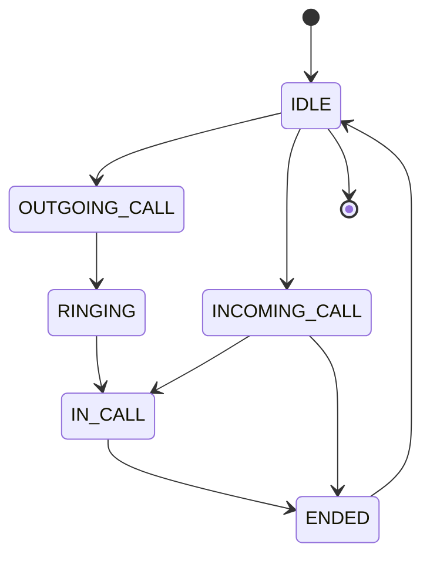
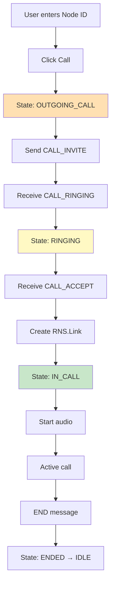
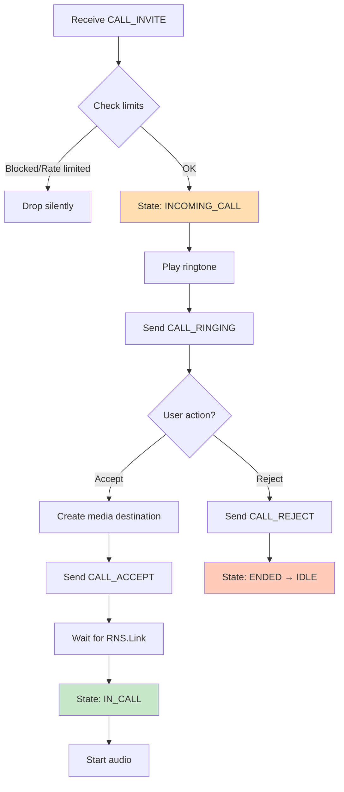
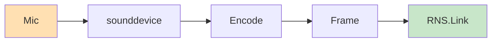
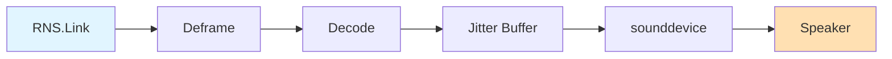
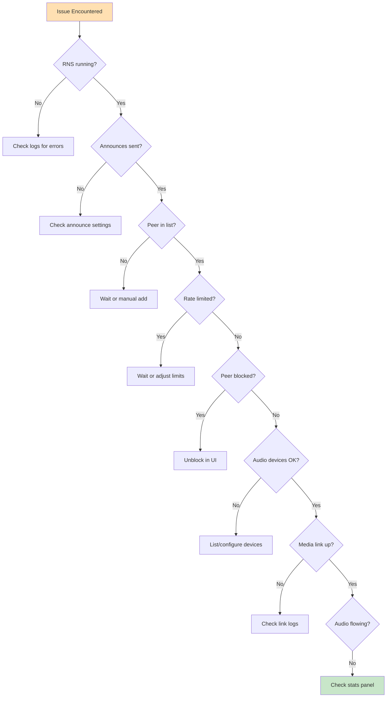

# LXST Phone Quick Reference

**Developer Guide**

## Key Components at a Glance

### Entry Point

```
main.py → lxst_phone/app.py:run_app()
```

### Core Modules

| Module             | Description                                       |
| ------------------ | ------------------------------------------------- |
| `app.py`           | Main application initialization and Qt event loop |
| `config.py`        | Configuration management (JSON persistence)       |
| `identity.py`      | Cryptographic identity handling                   |
| `call_history.py`  | Encrypted call history storage                    |
| `peers_storage.py` | Peer database management                          |
| `rate_limiter.py`  | Anti-spam rate limiting                           |
| `ringtone.py`      | Ringtone playback                                 |

### Core Package (`core/`)

| Module                | Description                                 |
| --------------------- | ------------------------------------------- |
| `call_state.py`       | Call state machine (FSM)                    |
| `signaling.py`        | Call message protocol and codec negotiation |
| `reticulum_client.py` | RNS integration and peer discovery          |
| `media.py`            | Audio pipeline and RNS.Link management      |
| `message_filter.py`   | Message validation and deduplication        |

### UI Package (`ui/`)

| Module                   | Description                   |
| ------------------------ | ----------------------------- |
| `main_window.py`         | Primary application window    |
| `peers_window.py`        | Peer management interface     |
| `call_history_window.py` | Call history viewer           |
| `security_dialogs.py`    | SAS verification and warnings |

---

## Important Paths

| Type             | Path                                   |
| ---------------- | -------------------------------------- |
| **Identity**     | `~/.lxst_phone/identity`               |
| **Config**       | `~/.lxst_phone/config.json`            |
| **Peers**        | `~/.lxst_phone/peers.json`             |
| **Call History** | `~/.lxst_phone/call_history.encrypted` |
| **Logs**         | `~/.lxst_phone/lxst_phone.log`         |

---

## Call State Machine



| State             | Description                    |
| ----------------- | ------------------------------ |
| **IDLE**          | No active call                 |
| **OUTGOING_CALL** | Initiated call, sent INVITE    |
| **RINGING**       | Remote acknowledged, alerting  |
| **INCOMING_CALL** | Received INVITE, awaiting user |
| **IN_CALL**       | Active call, media flowing     |
| **ENDED**         | Call terminated, cleaning up   |

---

## Message Types

| Message Type        | Purpose                            |
| ------------------- | ---------------------------------- |
| `CALL_INVITE`       | Initiate a call                    |
| `CALL_RINGING`      | Acknowledge invite, alerting user  |
| `CALL_ACCEPT`       | Accept call, provide media info    |
| `CALL_REJECT`       | Decline call                       |
| `CALL_END`          | Terminate active call              |
| `PRESENCE_ANNOUNCE` | Peer discovery (via RNS announces) |

---

## Call Flow Summary

### Outgoing Call



1. User enters remote Node ID, clicks Call
2. State: IDLE → OUTGOING_CALL
3. Send CALL_INVITE with codec preferences
4. Receive CALL_RINGING
5. State: OUTGOING_CALL → RINGING
6. Receive CALL_ACCEPT with media destination
7. Create RNS.Link to remote media destination
8. State: RINGING → IN_CALL
9. Start audio capture/playback
10. Call proceeds until END message

### Incoming Call



1. Receive CALL_INVITE
2. Check rate limiter and blocklist
3. State: IDLE → INCOMING_CALL
4. Play incoming ringtone, show UI
5. Send CALL_RINGING to caller
6. User clicks Accept or Reject
7. If Accept:
    * Create media destination
    * Send CALL_ACCEPT with destination info
    * Wait for RNS.Link from caller
    * State: INCOMING_CALL → IN_CALL
    * Start audio capture/playback
8. If Reject:
    * Send CALL_REJECT
    * State: INCOMING_CALL → ENDED → IDLE

---

## Audio Pipeline

### Capture (Transmit)



**Mic → sounddevice → Encode → Frame → RNS.Link**

### Playback (Receive)



**RNS.Link → Deframe → Decode → Jitter Buffer → sounddevice → Speaker**

---

## Codec Defaults

| Codec      | Settings                            |
| ---------- | ----------------------------------- |
| **Opus**   | 48 kHz, 20 ms frames, 24 kbps, mono |
| **Codec2** | 8 kHz, 3200 bps mode, mono          |

---

## Running the Application

```bash
# Basic usage
python main.py

# With custom identity
python main.py --identity /path/to/identity

# Disable automatic announces
python main.py --no-announce

# Set custom display name
python main.py --display-name "Alice's Phone"

# Show identity info and exit
python main.py --show-identity

# Disable audio (testing)
python main.py --no-audio

# Custom audio devices
python main.py --audio-input-device 1 --audio-output-device 2
```

---

## Development Commands

```bash
# Run tests (locally created, not part of package)
pytest tests/

# Run with coverage (locally created, not part of package)
pytest --cov=lxst_phone tests/

# Type checking 
mypy lxst_phone/

# Linting
ruff check lxst_phone/

# Format code
black lxst_phone/ tests/
```

---

## Configuration Hierarchy

1. Command-line arguments (highest priority)
2. config.json user settings
3. Code defaults (lowest priority)

---

## Security Features

* **Transport Encryption**: All RNS traffic encrypted (AES-128)
* **Identity Verification**: SAS (Short Authentication String) codes
* **Rate Limiting**: 3 calls/min, 10 calls/hour per peer
* **Blocklist**: Persistent blocking of unwanted peers
* **Call History Encryption**: Fernet encryption at rest

---

## Common Debugging Tasks

### Check RNS Transport Status

Look for "RNS Transport ready" in logs at startup. Connection status indicator in UI shows current state.

### Verify Peer Discovery

Check peers window for discovered nodes. Enable debug logging to see announce messages.

### Audio Issues

```bash
# List available audio devices
python -c "import sounddevice as sd; print(sd.query_devices())"

# Test with specific devices
python main.py --audio-input-device 1 --audio-output-device 2
```

### Enable Debug Logging

Edit `logging_config.py` to set level to DEBUG for specific modules.

---

## Key Constants

| Constant              | Value   | Description      |
| --------------------- | ------- | ---------------- |
| `PACKET_TYPE_AUDIO`   | `0x01`  | Audio frame      |
| `PACKET_TYPE_PING`    | `0x02`  | RTT measurement  |
| `PACKET_TYPE_CONTROL` | `0x03`  | Control messages |
| `DEFAULT_SAMPLE_RATE` | `48000` | Hz               |
| `DEFAULT_FRAME_MS`    | `20`    | ms               |
| `DEFAULT_JITTER_MS`   | `60`    | ms               |

---

## Testing Scenarios

### Local Testing

Run two instances with different identities:

```bash
# Terminal 1
python main.py --identity ~/.lxst_phone/identity1 \
    --audio-output-device 0

# Terminal 2
python main.py --identity ~/.lxst_phone/identity2 \
    --audio-input-device 0 --audio-output-device 1
```

### Simulation Mode

```bash
python main.py --simulate-incoming \
    --simulate-delay-ms 2000
```

---

## Troubleshooting Checklist



1. Is RNS transport running? (Check connection indicator)
2. Are announces being sent? (Check logs)
3. Is peer in known_peers? (Check peers window)
4. Is call being rate limited? (Check logs for "rate limit" messages)
5. Is peer blocked? (Check peers window for blocklist)
6. Are audio devices available? (List devices with sounddevice)
7. Is media link established? (Check logs for "Link established")
8. Are audio packets flowing? (Check stats panel during call)
