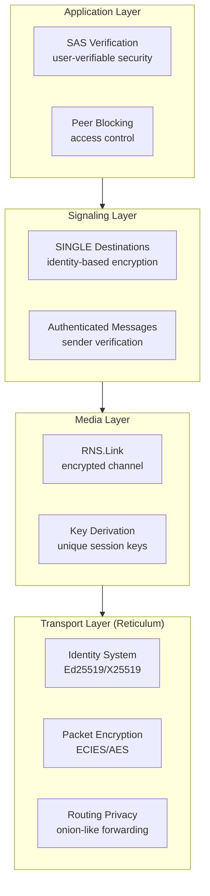

# Security Architecture and Implementation

This document explains the security features of LXST Phone, including Reticulum's cryptographic foundation and the Short Authentication String (SAS) verification system.

## Security Layers

LXST Phone provides multiple layers of security:



## Reticulum's Cryptographic Foundation

### Identity System

Every LXST Phone instance has a cryptographic identity stored in `~/.lxst_phone/identity`:

```python
# Creating an identity
identity = RNS.Identity()
# Or loading existing
identity = RNS.Identity(create_keys=False)
identity.load(identity_file_path)
```

**Identity components:**

* **Private key** - Never shared, never transmitted
* **Public key** - Shared in announces, used for encryption
* **Identity hash** - SHA256(public_key), used as node ID

**Key types supported by Reticulum:**

* **Ed25519** - Signing and encryption (default)
* **X25519** - Encryption only (Curve25519)

**Storage format:**
```
~/.lxst_phone/identity
├─ Private key (secret, must be protected)
└─ Public key (derived from private key)
```

**Security properties:**

* **Unique** - Cryptographically improbable to generate same identity
* **Verifiable** - Public key proves ownership
* **Portable** - Can be backed up and restored
* **Persistent** - Same identity across sessions

### Node ID Derivation

```python
node_id = identity.hash.hex()
# Example: "a3f5c8d2e1b4c7f9..."
```

**Properties:**

* 32 bytes (256 bits) when raw
* 64 hex characters when displayed
* Truncated to first 16 chars in UI for readability
* Cannot be reversed to get public/private key (one-way hash)

### Destination Hashing

Destinations are deterministically derived:

```python
dest_hash = SHA256(
    identity.hash +
    "lxst_phone" +     # App namespace
    "call"              # Aspect
)
```

**Why this matters:**

* Same identity + namespace + aspect = Same destination hash
* Enables destination reconstruction from public key
* Prevents destination spoofing (only identity owner can use it)

## Signaling Security

### SINGLE Destination Encryption

All signaling uses SINGLE destinations which provide:

1. **Public Key Encryption**
    * Messages encrypted with recipient's public key
    * Only recipient can decrypt (has private key)
    * Uses ECIES (Elliptic Curve Integrated Encryption Scheme)

2. **Sender Authentication**
    * Sender's public key included in packet
    * Receiver can verify sender identity
    * Prevents impersonation

3. **Message Integrity**
    * Encrypted packets include MAC (Message Authentication Code)
    * Detects tampering
    * Automatic rejection of modified packets

### Encryption Process (Sending)

```
Alice wants to send CALL_INVITE to Bob:

1. Alice has Bob's public key (from announce)
2. Reconstruct Bob's destination
3. Serialize message to JSON
4. RNS.Packet(bob_dest, message_bytes)
5. Reticulum encrypts:
   a. Generate ephemeral keypair
   b. Perform ECDH with Bob's public key
   c. Derive AES key from shared secret
   d. Encrypt message with AES-128
   e. Include ephemeral public key in packet
6. Packet transmitted
```

### Decryption Process (Receiving)

```
Bob receives encrypted packet:

1. Reticulum extracts ephemeral public key
2. Perform ECDH with own private key
3. Derive same AES key
4. Decrypt message
5. Verify MAC
6. Deliver plaintext to callback
```

**Security properties:**

* **Confidentiality** - Only Bob can read the message
* **Authenticity** - Bob knows it came from Alice
* **Integrity** - Bob detects if message was altered
* **Perfect Forward Secrecy** - NO (uses static identity keys)

### Why Not Perfect Forward Secrecy?

**PFS requires:**

* Ephemeral key exchange for each session
* Key deletion after use
* More complex protocol

**Reticulum's SINGLE destinations:**

* Use static identity keys
* Simpler implementation
* Trade-off for ease of use

**Mitigation:**

* RNS.Link (for media) uses session keys
* Regular identity rotation possible
* Compromise of identity doesn't reveal past Link sessions

## Media Security

### RNS.Link Encryption

Media streams use RNS.Link, which provides stronger security than signaling:

**Link establishment:**
```python
# Initiator creates link
link = RNS.Link(remote_destination)

# Responder receives link request
# (via destination's link_established_callback)
```

**Link handshake:**

1. Initiator sends link request (encrypted with destination's public key)
2. Responder validates request
3. Responder sends link proof (proves identity)
4. **Session keys derived** using ECDH
5. Link marked as established

**Session key derivation:**
```
shared_secret = ECDH(initiator_ephemeral_key, responder_static_key)
session_key = HKDF(shared_secret, link_id)
```

**Security properties:**

* **Forward secrecy** - Link keys not derivable from identity keys
* **Unique per session** - New keys for each call
* **Bidirectional encryption** - Both directions use same session key
* **Automatic rekeying** - Long-lived links can rekey (not implemented in LXST Phone)

### Audio Frame Encryption

Each audio frame is encrypted:

```python
# In MediaSession
def _send_audio_frame(self, frame_data: bytes):
    # Frame audio packet
    packet_data = FrameFramer.frame(
        PACKET_TYPE_AUDIO,
        frame_data,
        seq=self.tx_seq
    )
    
    # Send over encrypted link
    self.link.send(packet_data)  # Automatically encrypted by RNS
```

**What's encrypted:**

* Audio codec data (Opus or Codec2 frames)
* Packet type markers
* Sequence numbers
* Entire payload

**What's NOT encrypted:**

* Link ID (needed for routing)
* Packet length
* Timing information (observable by network monitors)

### Link Tear-Down Security

When call ends:

```python
link.teardown()
```

**What happens:**

* Session keys zeroed in memory
* Link state cleared
* Future packets rejected
* Resources released

**Key zeroization:**
```python
def secure_zero_bytes(data: bytearray) -> None:
    """Securely zero out sensitive data."""
    if isinstance(data, bytearray):
        for i in range(len(data)):
            data[i] = 0
```

**Note:** Python's garbage collector may still leave copies. This is a best-effort measure.

## Short Authentication String (SAS)

### Purpose

SAS provides **user-verifiable security** to detect Man-in-the-Middle (MITM) attacks:

**Scenario:** Alice calls Bob

* Without SAS: Can't verify they're talking to the real Bob
* With SAS: Verbal code comparison proves identity

**Attack it prevents:**
```
Alice ──→ [Attacker] ──→ Bob
         (MITM relay)

Without SAS: Alice thinks she's talking to Bob
With SAS: Codes don't match, attack detected
```

### SAS Generation

Location: `lxst_phone/core/media.py`

```python
def generate_sas(key_material: bytes, length: int = 4) -> str:
    """
    Generate a Short Authentication String from key material.
    
    Uses SHA-256 hash and converts to decimal digits for verbal verification.
    
    Args:
        key_material: Raw bytes from link keys or identity
        length: Number of digits (default 4 for easy verification)
    
    Returns:
        String of decimal digits (e.g., "7342")
    """
    hash_bytes = hashlib.sha256(key_material).digest()
    value = int.from_bytes(hash_bytes[:4], byteorder="big")
    digits = 10**length
    sas_value = value % digits
    return f"{sas_value:0{length}d}"
```

**Algorithm:**

1. Hash key material with SHA-256
2. Take first 4 bytes of hash
3. Convert to integer (big-endian)
4. Modulo 10^4 (gives 0-9999)
5. Format as 4-digit string with leading zeros

**Key material sources:**
```python
# In MediaSession after link established
if self.link and hasattr(self.link, 'link_id'):
    # Use link ID (derived from session keys)
    key_material = self.link.link_id
else:
    # Fallback: use identity hashes
    key_material = (
        self.call_info.local_id.encode('utf-8') +
        self.call_info.remote_id.encode('utf-8')
    )

sas_code = generate_sas(key_material)
```

**Preferred:** Link ID (unique per session, includes session keys)
**Fallback:** Identity hashes (static but better than nothing)

### SAS Verification Dialog

Location: `lxst_phone/ui/security_dialogs.py`

```python
class SASVerificationDialog(QDialog):
    """
    Dialog for verifying Short Authentication String (SAS) codes.
    
    Displays the SAS code prominently and explains the verification process.
    """
```

**Dialog flow:**

1. Call is established
2. SAS code generated from Link ID
3. Dialog shown to user with large code display
4. Instructions for verification:
    * "Ask the other person to read their security code"
    * "Compare it with the code shown above"
    * "If they match exactly, click 'Codes Match'"
    * "If they don't match, click 'Codes Don't Match'"

**User actions:**

* **"Codes Match"** → Mark peer as verified, close dialog
* **"Codes Don't Match"** → Show security warning, offer to end call
* **"Verify Later"** → Close dialog without marking verified

### SAS Security Properties

**Strength:**

* 4 digits = 10,000 possible values
* MITM attacker has 0.01% chance of matching code
* Strong enough for voice verification
* Weak against automated attacks (use longer code if paranoid)

**Why 4 digits?**

* Easy to read over voice call
* Hard to mishear
* Quick verification
* Balance of security and usability

**Alternatives considered:**

* **6 digits** - More secure but harder to verify
* **Word list** - More memorable but more complex
* **Visual hash** - Requires screen sharing

### Verification Persistence

When user confirms SAS match:

```python
# In MediaSession
self.sas_verified = True

# In UI
peer = self.peers_storage.get_peer(remote_id)
if peer:
    peer.verified = True
    self.peers_storage.save()
```

**Benefits:**

* Verified status persists across calls
* Future calls with same peer skip verification
* User can see verified status in peer list
* Can be manually reset if needed

**Storage:**
```json
{
  "peers": [{
    "node_id": "a3f5c8...",
    "display_name": "Alice",
    "verified": true
  }]
}
```

### MITM Detection

**When codes don't match:**

```python
def _on_codes_dont_match(self) -> None:
    """Handle codes not matching - serious security warning."""
    reply = QMessageBox.warning(
        self,
        "Security Alert",
        "The security codes don't match!\n\n"
        "This could mean:\n"
        "• Someone is intercepting your call (man-in-the-middle attack)\n"
        "• There's a network issue\n"
        "• One of you is using an outdated version\n\n"
        "Do you want to end this call for security reasons?",
        QMessageBox.StandardButton.Yes | QMessageBox.StandardButton.No,
        QMessageBox.StandardButton.Yes,
    )
    
    if reply == QMessageBox.StandardButton.Yes:
        self.verified = False
        self.reject()
```

**What this detects:**

* **Active MITM** - Attacker relaying with different session keys
* **Identity spoofing** - Someone pretending to be the peer
* **Network proxy** - Intercepting middlebox

**What this DOESN'T detect:**

* **Passive eavesdropping** - If encryption is broken
* **Endpoint compromise** - If peer's device is hacked
* **Correlation attacks** - Traffic analysis

## Threat Model

### What LXST Phone Protects Against

**1. Passive Eavesdropping**

* ✅ All signaling encrypted (SINGLE destinations)
* ✅ All media encrypted (RNS.Link)
* ✅ Confidentiality guaranteed (unless crypto is broken)

**2. Active MITM Attacks**

* ✅ Detected by SAS verification
* ✅ User warned before continuing
* ⚠️ User must actually verify SAS (not automatic)

**3. Impersonation**

* ✅ Node IDs derived from cryptographic identities
* ✅ Cannot impersonate without private key
* ⚠️ User must verify they're calling intended peer

**4. Denial of Service**

* ✅ Rate limiting (5 calls/min, 20 calls/hour)
* ✅ Peer blocking
* ⚠️ Network-level DoS not addressed

**5. Spam/Harassment**

* ✅ Blocking feature
* ✅ Rate limiting
* ✅ Persistent across restarts

### What LXST Phone Does NOT Protect Against

**1. Endpoint Compromise**

* ❌ Malware on user's device
* ❌ Keyloggers
* ❌ Screen capture
* **Mitigation:** OS security, antivirus, user awareness

**2. Identity Theft**

* ❌ If identity file is stolen
* ❌ No password protection on identity file
* **Mitigation:** Filesystem permissions, backup encryption

**3. Traffic Analysis**

* ❌ Packet sizes observable
* ❌ Timing observable
* ❌ Destinations observable (node IDs in routing)
* **Mitigation:** Run Reticulum over Tor/I2P

**4. Rubber Hose Cryptanalysis**

* ❌ Physical coercion
* ❌ Legal compulsion
* **Mitigation:** Deniability features not implemented

**5. Quantum Computers**

* ❌ ECC vulnerable to Shor's algorithm
* ❌ No post-quantum crypto
* **Mitigation:** Wait for Reticulum to add post-quantum support

## Security Best Practices

### For Users

**Identity Protection:**

* Backup `~/.lxst_phone/identity` to secure location
* Don't share identity file
* Set restrictive filesystem permissions: `chmod 600 ~/.lxst_phone/identity`

**Verification:**

* Always verify SAS codes on first call
* Don't skip verification with unknown peers
* Re-verify if codes change unexpectedly

**Peer Management:**

* Block abusive peers immediately
* Review peer list periodically
* Remove old/unused peers

**Network Security:**

* Use Reticulum over VPN/Tor for metadata privacy
* Be aware of local network monitoring
* Consider radio links inherently observable

### For Developers

**Key Management:**

* Never log private keys
* Zero sensitive memory when possible
* Use secure random sources (RNS handles this)

**Error Handling:**

* Don't leak cryptographic errors to attackers
* Fail closed (reject on verification failure)
* Log security events

**Dependency Security:**

* Keep Reticulum updated (crypto fixes)
* Monitor for CVEs in dependencies
* Verify package signatures

## Encryption Specifications

### Algorithms Used

**Identity Keys:**

* Ed25519 (default) - 256-bit signing + encryption
* X25519 (optional) - 256-bit encryption only

**Packet Encryption (SINGLE destinations):**

* ECIES (Elliptic Curve Integrated Encryption Scheme)
* AES-128-CBC for symmetric encryption
* HMAC-SHA256 for authentication
* Ephemeral key per packet (partial PFS)

**Link Encryption:**

* ECDH for key exchange
* HKDF for key derivation
* AES-128-CBC for data encryption
* Per-session keys (full PFS within Link lifetime)

**Hashing:**

* SHA-256 for identity hashes
* SHA-256 for destination hashes
* SHA-256 for SAS generation

### Key Sizes

| Component | Key Size | Security Level |
|-----------|----------|----------------|
| Ed25519 Private Key | 256 bits | ~128-bit security |
| Ed25519 Public Key | 256 bits | ~128-bit security |
| AES Session Key | 128 bits | 128-bit security |
| SHA-256 Output | 256 bits | 128-bit preimage resistance |
| Destination Hash | 256 bits | 128-bit collision resistance |

**Note:** 128-bit security is considered strong (2^128 operations to break).

## Security Comparison

### vs. Traditional VoIP (SIP/RTP)

| Feature | LXST Phone | SIP/RTP |
|---------|------------|---------|
| Signaling Encryption | Yes (always) | Optional (TLS) |
| Media Encryption | Yes (always) | Optional (SRTP) |
| Identity-Based | Yes | No (uses addresses) |
| Central Server | No | Yes (registrar) |
| MITM Detection | Yes (SAS) | Optional (ZRTP) |
| Metadata Privacy | Partial | No |

### vs. Signal Protocol

| Feature | LXST Phone | Signal |
|---------|------------|--------|
| Perfect Forward Secrecy | Partial (Links only) | Yes (Double Ratchet) |
| Post-Quantum | No | No |
| SAS Verification | Yes | Yes (Safety Numbers) |
| Centralized Infrastructure | No | Yes |
| Mesh Networking | Yes | No |
| Bandwidth Requirement | Lower (Codec2) | Higher |

**LXST Phone advantages:**

* Decentralized
* Works on mesh/radio networks
* Lower bandwidth options

**Signal advantages:**

* Stronger forward secrecy
* Better studied protocol
* Larger user base (network effect)

## Future Security Enhancements

### Planned

1. **Identity Encryption**
    * Password-protect identity file
    * Use key derivation (PBKDF2/Argon2)

2. **Call History Encryption**
    * Already implemented (optional)
    * Encrypt with user password

3. **Improved SAS**
    * Longer codes (6 digits)
    * Word list option
    * Visual hash display

### Possible

1. **Post-Quantum Crypto**
    * Waiting for Reticulum support
    * Hybrid classic/PQ scheme

2. **Disappearing Messages**
    * Auto-delete call history
    * Configurable retention

3. **Deniability**
    * Off-the-record messaging concepts
    * Plausible deniability for calls

### Not Planned

1. **Backdoors/Key Escrow** - Never
2. **Metadata Logging** - Never
3. **Central Control** - Incompatible with design

## Audit Status

**Code Audit:** Not professionally audited (open source project)

**Cryptographic Library:** Reticulum (also not formally audited, but actively developed)

**Recommendation:** Do not use for life-or-death security scenarios without professional audit.

**Good for:**

* Privacy-conscious communication
* Mesh network voice calls
* Learning cryptographic protocols
* Emergency communication

**Not suitable for:**

* Protecting state secrets
* Witness protection
* Military operations
* High-value targets

Use appropriate security based on your threat model.
