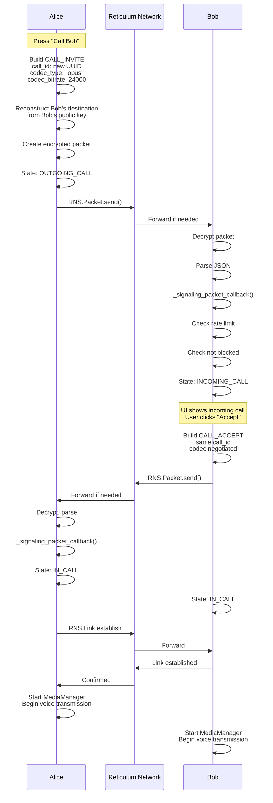
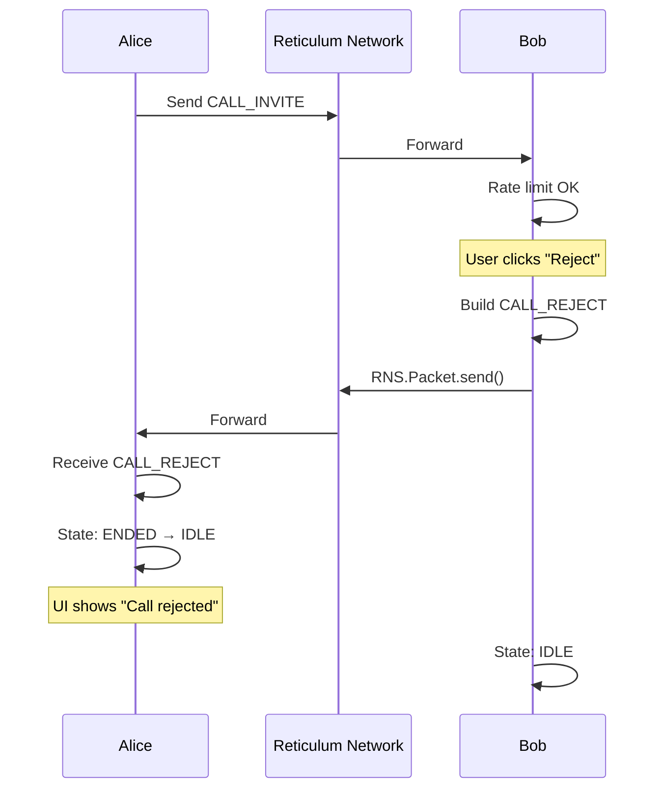
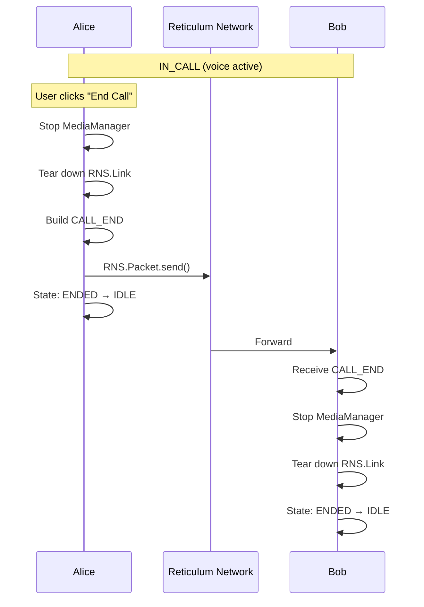

# Call Signaling Over Reticulum

This document explains how LXST Phone implements call control signaling using Reticulum's encrypted packet system.

## Overview

LXST Phone signaling uses Reticulum's **SINGLE destination** feature for secure, encrypted peer-to-peer messaging. Unlike traditional VoIP which uses SIP over UDP/TCP, LXST Phone signaling:

* **No central server** - Direct peer-to-peer signaling
* **End-to-end encrypted** - All messages encrypted with recipient's public key
* **Authenticated** - Sender can be cryptographically verified
* **Transport agnostic** - Works over any Reticulum interface
* **Mesh-friendly** - Automatically routed through multi-hop networks

## Signaling Architecture

### Two Phases of Communication

1. **Discovery (Announces)** - Broadcast presence to find peers (documented in `announces.md`)
2. **Signaling (Messages)** - Encrypted point-to-point call control (this document)

### Destination Types

LXST Phone uses **one SINGLE destination per peer** for call signaling:

```python
# Created during startup
self.call_dest = RNS.Destination(
    self.node_identity,         # Our identity
    RNS.Destination.IN,         # Incoming (we receive)
    RNS.Destination.SINGLE,     # Encrypted, identity-bound
    "lxst_phone",               # App namespace
    "call",                     # Signaling aspect
)
```

**Key properties:**

* **SINGLE** means only the holder of `node_identity` can decrypt packets
* **Deterministic** - Same identity always produces same destination hash
* **Secure** - Uses elliptic curve cryptography (X25519 or Ed25519)

### Why Not Use PLAIN or GROUP?

**PLAIN destinations:**

* Not encrypted
* Anyone can read messages
* Unsuitable for call control

**GROUP destinations:**

* Shared key among multiple recipients
* Requires key distribution
* Unnecessary complexity for 1-to-1 calls

**SINGLE destinations:**

* Automatic encryption using recipient's public key
* No key exchange needed (key from announce)
* Perfect for point-to-point signaling

## Message Types

All signaling uses the `CallMessage` dataclass defined in `lxst_phone/core/signaling.py`.

### Message Type Enum

```python
CallMessageType = Literal[
    "CALL_INVITE",           # Initiate a call
    "CALL_RINGING",          # Optional: acknowledge receipt of invite
    "CALL_ACCEPT",           # Accept the call
    "CALL_REJECT",           # Decline the call
    "CALL_END",              # Terminate active call
    "PRESENCE_ANNOUNCE",     # Discovery (handled separately)
]
```

### CallMessage Structure

```python
@dataclass
class CallMessage:
    msg_type: CallMessageType
    call_id: str                          # UUID for this call
    from_id: str                          # Sender's node ID
    to_id: str                            # Recipient's node ID
    display_name: str | None = None       # Human-readable name
    call_dest: str | None = None          # Destination hash for media
    call_identity_key: str | None = None  # Public key (base64)
    codec_type: str | None = None         # "opus" or "codec2"
    codec_bitrate: int | None = None      # Bitrate in bps
    timestamp: float = 0.0                # Unix timestamp
```

### Serialization

Messages are serialized to JSON for transmission:

```python
def to_payload(self) -> Dict[str, Any]:
    payload = {
        "type": self.msg_type,
        "call_id": self.call_id,
        "from": self.from_id,
        "to": self.to_id,
    }
    
    # Optional fields included only if present
    if self.display_name:
        payload["display_name"] = self.display_name
    if self.call_dest:
        payload["call_dest"] = self.call_dest
    if self.call_identity_key:
        payload["call_identity_key"] = self.call_identity_key
    if self.codec_type:
        payload["codec_type"] = self.codec_type
    if self.codec_bitrate is not None:
        payload["codec_bitrate"] = self.codec_bitrate
    if self.timestamp:
        payload["timestamp"] = self.timestamp
    
    return payload
```

**Wire format example:**
```json
{
  "type": "CALL_INVITE",
  "call_id": "550e8400-e29b-41d4-a716-446655440000",
  "from": "a3f5c8d2e1...",
  "to": "7b9e4c1f3a...",
  "display_name": "Alice",
  "call_dest": "d4e5f6a7b8...",
  "call_identity_key": "MC4CAQ...=",
  "codec_type": "opus",
  "codec_bitrate": 24000,
  "timestamp": 1700912445.123456
}
```

**Size:** Typically 250-380 bytes when serialized (JSON plaintext).

**Encrypted size:** Add ~64 bytes for ECIES/AES-128 encryption overhead (ephemeral key, MAC, padding).

**MTU Compliance:** All signaling messages fit comfortably under Reticulum's 500-byte MTU limit. Identity keys are intentionally excluded from CALL_INVITE and CALL_ACCEPT messages to keep packet size minimal - they are obtained from announce-populated `known_peers` dictionary instead.

## Sending Signaling Messages

### Prerequisites

Before sending, we must:

1. Have received an announce from the peer (know their identity/destination)
2. Have the peer in `known_peers` dictionary
3. Be able to reconstruct their SINGLE destination

### send_call_message() Method

Location: `lxst_phone/core/reticulum_client.py`

```python
def send_call_message(self, msg: CallMessage) -> None:
    """
    Send a call signaling message to a specific peer's SINGLE call destination.
    """
    if not self.reticulum:
        raise RuntimeError("Reticulum not initialised")
    
    if not msg.to_id:
        raise ValueError("to_id required for call signaling messages")
    
    # Look up peer information from discovery
    peer_info = self.known_peers.get(msg.to_id)
    if not peer_info:
        raise RuntimeError(
            f"Unknown peer {msg.to_id[:16]}... - no call destination. "
            "Ensure peer has announced presence first."
        )
    
    call_dest_hash, call_identity_key = peer_info
    
    # Serialize message
    payload_bytes = json.dumps(msg.to_payload()).encode("utf-8")
```

### Reconstructing Remote Destination

Critical step: We must recreate the peer's exact destination:

```python
try:
    # Decode base64 public key
    pub_key_bytes = base64.b64decode(call_identity_key)
    
    # Create identity from public key
    remote_identity = RNS.Identity(create_keys=False)
    remote_identity.load_public_key(pub_key_bytes)
    
    # Reconstruct destination (must match their incoming destination)
    remote_call_dest = RNS.Destination(
        remote_identity,
        RNS.Destination.OUT,      # OUT for sending
        RNS.Destination.SINGLE,
        "lxst_phone",
        "call",
    )
    
    # Verify hash matches what we received in announce
    if remote_call_dest.hash.hex() != call_dest_hash:
        logger.warning(
            f"Reconstructed call dest {remote_call_dest.hash.hex()} "
            f"!= expected {call_dest_hash}"
        )
except Exception as exc:
    raise RuntimeError(
        f"Failed to reconstruct remote call destination: {exc}"
    ) from exc
```

**Why this works:**

* Destination hash is deterministic: `hash(identity + "lxst_phone" + "call")`
* We have the peer's public key from their announce
* We use the same parameters ("lxst_phone", "call")
* Result: Same destination hash, can send encrypted packets

### Creating and Sending Packet

```python
# Create Reticulum packet
packet = RNS.Packet(remote_call_dest, payload_bytes)

try:
    send_ok = packet.send()
except Exception as exc:
    raise RuntimeError(f"Failed to queue signaling packet: {exc}") from exc

if send_ok is False:
    raise RuntimeError("RNS.Packet.send() returned False")

logger.info(
    f"Sent {msg.msg_type} to {msg.to_id[:16]}... "
    f"via SINGLE dest {call_dest_hash[:16]}... ({len(payload_bytes)} bytes)"
)
```

**What happens in RNS.Packet.send():**

1. Packet is encrypted with recipient's public key
2. Packet is added to Reticulum's outbound queue
3. Reticulum looks up route to destination
4. Packet is transmitted via appropriate interface(s)
5. Intermediate nodes forward as needed
6. Recipient receives and decrypts

**Return value:**
* `True` - Packet queued successfully
* `False` - Queueing failed (very rare)

## Receiving Signaling Messages

### Packet Callback Registration

During startup, we register a callback:

```python
self.call_dest.set_packet_callback(self._signaling_packet_callback)
```

**How it works:**

* Reticulum monitors network for packets to this destination
* When packet arrives, Reticulum decrypts it (we hold the private key)
* Reticulum calls our callback with decrypted data

### _signaling_packet_callback() Method

```python
def _signaling_packet_callback(self, data: bytes, packet: RNS.Packet) -> None:
    """Handle call signaling messages on SINGLE signaling channel."""
    logger.debug(f"Signaling packet: {len(data)} bytes")
    
    if not self.on_message:
        logger.warning("NO on_message handler registered, dropping packet")
        return
```

**Thread safety note:** This callback runs in a Reticulum thread, NOT the GUI thread.

### Deserialization and Validation

```python
try:
    payload_text = data.decode("utf-8", errors="replace")
    payload = json.loads(payload_text)
    msg = CallMessage.from_payload(payload)
    logger.debug(
        f"Parsed signaling: type={msg.msg_type}, "
        f"from={msg.from_id[:16]}..., to={msg.to_id[:16]}..."
    )
except Exception as exc:
    logger.error(f"Failed to parse signaling message: {exc}")
    return
```

**Error handling:**

* Malformed UTF-8: Logged and dropped
* Invalid JSON: Logged and dropped
* Missing required fields: Exception in `from_payload()`, logged and dropped

### Dispatching to Handler

```python
try:
    self.on_message(msg)
except Exception as exc:
    logger.error(f"Error in on_message handler: {exc}")
```

**Handler registration (in app.py):**
```python
def on_message_from_rns(msg):
    logger.debug(f"on_message_from_rns called for type={msg.msg_type}")
    window.incomingCallMessage.emit(msg)

rclient.on_message = on_message_from_rns
```

**Qt signal emission:**

* `window.incomingCallMessage` is a Qt signal
* `.emit(msg)` marshals the call to the GUI thread
* MainWindow handles it in `_on_incoming_call_message()`

## Message Flow Examples

### Example 1: Outgoing Call (INVITE → ACCEPT)



### Example 2: Rejecting Call (INVITE → REJECT)



### Example 3: Ending Active Call



## Message Handler in MainWindow

Location: `lxst_phone/ui/main_window.py`

### Message Routing

```python
@Slot(CallMessage)
def _on_incoming_call_message(self, msg: CallMessage):
    """Handle incoming call signaling message (runs in GUI thread)."""
    logger.debug(f"Incoming message: {msg.msg_type}")
    
    if msg.msg_type == "PRESENCE_ANNOUNCE":
        self._handle_presence_announce(msg)
    elif msg.msg_type == "CALL_INVITE":
        self._handle_incoming_invite(msg)
    elif msg.msg_type == "CALL_ACCEPT":
        self._handle_call_accept(msg)
    elif msg.msg_type == "CALL_REJECT":
        self._handle_call_reject(msg)
    elif msg.msg_type == "CALL_END":
        self._handle_call_end(msg)
    elif msg.msg_type == "CALL_RINGING":
        self._handle_call_ringing(msg)
    else:
        logger.warning(f"Unknown message type: {msg.msg_type}")
```

### Handling CALL_INVITE

```python
def _handle_incoming_invite(self, msg: CallMessage):
    """Process incoming call invitation."""
    remote_id = msg.from_id
    call_id = msg.call_id
    
    # Check if peer is blocked
    if self.peers_storage.is_blocked(remote_id):
        logger.info(
            f"Auto-rejecting call from blocked peer: {remote_id[:16]}..."
        )
        self.append_event(f"Blocked peer {remote_id[:16]}... - auto-rejected")
        
        # Send REJECT immediately
        reject_msg = build_reject(
            from_id=self.local_id,
            to_id=remote_id,
            call_id=call_id
        )
        try:
            self.reticulum_client.send_call_message(reject_msg)
        except Exception as exc:
            logger.error(f"Failed to send reject to blocked peer: {exc}")
        return
    
    # Check rate limit
    if not self.rate_limiter.is_allowed(remote_id):
        logger.warning(
            f"Rate limit exceeded for {remote_id[:16]}..., rejecting call"
        )
        self.append_event(
            f"Rate limited call from {remote_id[:16]}... - auto-rejected"
        )
        
        # Send REJECT
        reject_msg = build_reject(
            from_id=self.local_id,
            to_id=remote_id,
            call_id=call_id
        )
        try:
            self.reticulum_client.send_call_message(reject_msg)
        except Exception as exc:
            logger.error(f"Failed to send rate limit reject: {exc}")
        return
    
    # Check call state
    if self.call_state.phase not in (CallPhase.IDLE, CallPhase.ENDED):
        logger.info(f"Busy, rejecting call from {remote_id[:16]}...")
        
        # Send REJECT with busy reason
        reject_msg = build_reject(
            from_id=self.local_id,
            to_id=remote_id,
            call_id=call_id
        )
        try:
            self.reticulum_client.send_call_message(reject_msg)
        except Exception as exc:
            logger.error(f"Failed to send busy reject: {exc}")
        return
    
    # All checks passed, accept the invite
    call = CallInfo(
        call_id=call_id,
        local_id=self.local_id,
        remote_id=remote_id,
        display_name=msg.display_name,
        initiated_by_local=False,
        remote_call_dest=msg.call_dest,
        remote_identity_key=msg.call_identity_key,
        negotiated_codec_type=msg.codec_type,
        negotiated_codec_bitrate=msg.codec_bitrate,
    )
    
    success = self.call_state.receive_incoming_invite(call)
    if success:
        self.append_event(
            f"Incoming call from {msg.display_name or remote_id[:16]}..."
        )
        self._play_ringtone()
```

## Codec Negotiation

### Negotiation Function

Location: `lxst_phone/core/signaling.py`

```python
def negotiate_codec(
    local_codec: str,
    local_bitrate: int,
    remote_codec: str | None,
    remote_bitrate: int | None,
) -> tuple[str, int]:
    """
    Negotiate codec settings between two peers.
    
    Returns (codec_type, bitrate) to use for the call.
    
    Rules:
    1. If remote doesn't specify, use local settings
    2. Codec2 takes priority over Opus (lower bandwidth)
    3. Within same codec, use lower bitrate
    """
    if remote_codec is None or remote_bitrate is None:
        return (local_codec, local_bitrate)
    
    local_bps = normalize_codec_bitrate(local_codec, local_bitrate)
    remote_bps = normalize_codec_bitrate(remote_codec, remote_bitrate)
    
    # Codec2 always wins (bandwidth conservation)
    if local_codec == "codec2" and remote_codec == "opus":
        return (local_codec, local_bitrate)
    elif remote_codec == "codec2" and local_codec == "opus":
        return (remote_codec, remote_bitrate)
    
    # Same codec: choose lower bitrate
    if local_bps <= remote_bps:
        return (local_codec, local_bitrate)
    else:
        return (remote_codec, remote_bitrate)
```

**Design philosophy:**

* **Codec2 over Opus** - Prioritize bandwidth efficiency for mesh networks
* **Lower bitrate** - Reduce network load, improve reliability
* **Graceful fallback** - If peer doesn't specify, use local preference

### Negotiation Flow

```
Alice sends INVITE:
  codec_type: "opus"
  codec_bitrate: 24000

Bob receives INVITE:
  Bob's preference: "codec2", 3200
  Negotiation: Codec2 wins (lower bandwidth)
  
Bob sends ACCEPT:
  codec_type: "codec2"
  codec_bitrate: 3200

Alice receives ACCEPT:
  Updates call state with negotiated codec
  MediaManager uses Codec2 @ 3200 bps
  
Bob creates MediaManager:
  Uses Codec2 @ 3200 bps
  
Result: Both parties use same codec
```

## Error Handling

### Unknown Peer

```python
peer_info = self.known_peers.get(msg.to_id)
if not peer_info:
    raise RuntimeError(
        f"Unknown peer {msg.to_id[:16]}... - no call destination. "
        "Ensure peer has announced presence first."
    )
```

**Recovery:** Wait for peer to announce, or manually trigger announce.

### Destination Reconstruction Failure

```python
try:
    remote_identity = RNS.Identity(create_keys=False)
    remote_identity.load_public_key(pub_key_bytes)
except Exception as exc:
    raise RuntimeError(
        f"Failed to reconstruct remote identity: {exc}"
    ) from exc
```

**Possible causes:**

* Corrupted public key in storage
* Incompatible Reticulum version
* Malformed announce data

### Packet Send Failure

```python
send_ok = packet.send()
if send_ok is False:
    raise RuntimeError("RNS.Packet.send() returned False")
```

**Causes:**

* Reticulum queue full (very rare)
* Interface failure
* Out of resources

### Malformed Messages

```python
try:
    payload = json.loads(payload_text)
    msg = CallMessage.from_payload(payload)
except Exception as exc:
    logger.error(f"Failed to parse signaling message: {exc}")
    return  # Drop packet
```

**Recovery:** None - malformed packets are silently dropped and logged.

## Performance Characteristics

### Latency

**Local network (AutoInterface):**

* Packet creation: < 1ms
* Encryption: < 5ms
* Transmission: 1-10ms
* Total: 5-20ms

**Internet (TCPClientInterface):**

* Plus network RTT: 20-200ms
* Total: 30-300ms

**Radio/LoRa:**

* Link speed dependent: 1-10 kbps
* Packet: ~500 bytes
* Transmission: 0.5-5 seconds
* Multi-hop: Add 1-5s per hop

### Bandwidth Usage

**Per message (encrypted):**

* CALL_INVITE: ~377 bytes JSON + ~64 bytes encryption = ~441 bytes
* CALL_ACCEPT: ~333 bytes JSON + ~64 bytes encryption = ~397 bytes
* CALL_REJECT: ~260 bytes JSON + ~64 bytes encryption = ~324 bytes
* CALL_END: ~254 bytes JSON + ~64 bytes encryption = ~318 bytes

**Encryption overhead breakdown:**

* Ephemeral public key (ECIES): 32 bytes
* Message Authentication Code (MAC): 16 bytes
* AES-128 padding: up to 16 bytes
* Total: ~64 bytes maximum

**Typical call setup:**

* INVITE: ~441 bytes
* ACCEPT: ~397 bytes
* Total: ~838 bytes for signaling

**Call teardown:**

* END: ~318 bytes

**Compare to SIP:**

* SIP INVITE: 500-1500 bytes (unencrypted)
* SIP 200 OK: 500-1000 bytes
* LXST Phone: Smaller and encrypted end-to-end

**MTU Compliance:**

* All packets well under 500-byte Reticulum MTU
* Design decision: Identity keys excluded from INVITE/ACCEPT to minimize size
* Retrieved from announces instead (stored in `known_peers`)

## MTU Compliance Design

Reticulum networks recommend a 500-byte MTU limit to ensure compatibility across all transport types (UDP, TCP, LoRa, packet radio, etc.). LXST Phone's signaling is carefully designed to stay well under this limit.

### Packet Size Budget

**Target:** All packets under 500 bytes encrypted

**Breakdown for CALL_INVITE (largest message):**
```
JSON Payload:              ~377 bytes
  - type: "CALL_INVITE"       15 bytes
  - call_id: UUID              38 bytes  
  - from_id: 64-char hex      66 bytes
  - to_id: 64-char hex        66 bytes
  - display_name: string      ~25 bytes (typical)
  - call_dest: 16-char hex    18 bytes
  - codec_type: "opus"        14 bytes
  - codec_bitrate: number     17 bytes
  - timestamp: float          20 bytes
  - JSON overhead             ~100 bytes (braces, quotes, commas)

Encryption Overhead:        ~64 bytes
  - Ephemeral public key      32 bytes
  - MAC (AES-128-GCM)        16 bytes
  - Padding alignment         0-16 bytes

Total:                      ~441 bytes
Margin:                     59 bytes under MTU
```

### Critical Design Decision: No Identity Keys in Signaling

**Problem:** Including identity keys would exceed MTU

* Identity public key: 32 bytes (base64: ~44 bytes)
* CALL_INVITE with key: ~485 bytes
* Dangerously close to 500-byte limit

**Solution:** Two-phase approach

1. **Discovery phase:** Announces distribute identity keys
    * Stored in `known_peers` dictionary: `{node_id: (dest_hash, identity_key)}`
    * Happens once per peer, periodic refresh
   
2. **Signaling phase:** Messages reference identity by ID
    * CALL_INVITE/ACCEPT omit `call_identity_key` field
    * Recipient reconstructs destination using stored key
    * Keeps packets small and fast

**Code evidence:**
```python
# main_window.py - CALL_INVITE creation
msg = build_invite(
    from_id=self.local_id,
    to_id=dest,
    display_name=display_name,
    call_dest=self.reticulum_client.call_dest_hash,
    call_id=call.call_id,
    codec_type=self.config.codec_type,
    codec_bitrate=...,
    # NOTE: call_identity_key NOT included - to keep packet size under MTU
)

# main_window.py - CALL_ACCEPT creation
msg = build_accept(
    from_id=self.local_id,
    to_id=call.remote_id,
    call_id=call.call_id,
    call_dest=self.reticulum_client.call_dest_hash,
    codec_type=codec_type,
    codec_bitrate=codec_bitrate,
    # NOTE: call_identity_key NOT included - to keep packet size under MTU
)
```

**Benefits:**

* Guaranteed MTU compliance on all networks
* Faster transmission (smaller packets)
* No fragmentation issues
* Works reliably on LoRa and other low-bandwidth transports

**Trade-off:**

* Requires prior announce reception before calls
* Cannot call unknown peers
* This is acceptable: discovery is a prerequisite anyway

### Packet Size Verification

The code logs actual packet sizes:
```python
logger.info(
    f"Sent {msg.msg_type} to {msg.to_id[:16]}... "
    f"via SINGLE dest {call_dest_hash[:16]}... ({len(payload_bytes)} bytes)"
)
```

Monitor logs to verify MTU compliance in production.

## Security Properties

### Encryption

* All signaling messages encrypted with recipient's public key
* Uses Reticulum's cryptographic primitives (X25519/Ed25519)
* Perfect forward secrecy NOT provided (SINGLE destinations use static keys)

### Authentication

* Messages provably from sender (encrypted with our public key, only we can decrypt)
* No replay protection at signaling layer (handled by call_id uniqueness)

### Denial of Service Protection

* Rate limiting per peer (documented in `call_management.md`)
* Blocking feature for abusive peers
* Reticulum's built-in transport rate limiting

### Privacy

* Message content encrypted end-to-end
* Message metadata visible to intermediate nodes:
    * Destination hash (not sender identity)
    * Packet size
    * Timestamp
* For metadata privacy, use Reticulum over Tor/I2P
